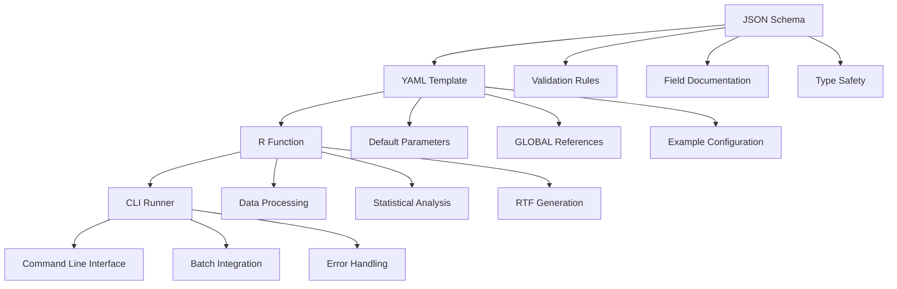
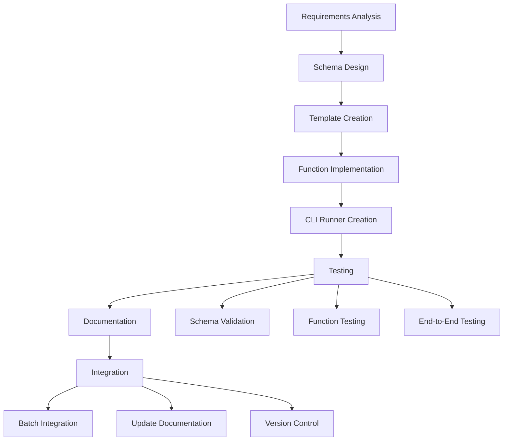

# AutoRTLF Developer Guide
AutoRTLF Development Team (Kan Li, Cursor) 2025-10-16

## Table of Contents
1. [Overview](#overview)
2. [Development Environment Setup](#development-environment-setup)
3. [Understanding the Template System](#understanding-the-template-system)
4. [Creating New TLF Templates](#creating-new-tlf-templates)
5. [Development Workflow](#development-workflow)
6. [Function Development Guidelines](#function-development-guidelines)
7. [Schema Development](#schema-development)
8. [Testing and Validation](#testing-and-validation)
9. [AI-Assisted Development](#ai-assisted-development)
10. [Best Practices](#best-practices)
11. [Troubleshooting](#troubleshooting)

## Overview

This guide provides comprehensive instructions for developers and AI systems to create new TLF (Tables, Listings, and Figures) templates in the AutoRTLF framework. The architecture emphasizes:

- **Template-driven development**: Reusable patterns for rapid TLF creation
- **Schema-validated configurations**: Ensuring correctness through JSON Schema validation
- **Consolidated function architecture**: Single R files containing complete analysis pipelines
- **Metadata-driven analysis**: Externalized configuration for flexibility

### Target Audience

- **Human Developers**: Clinical programmers, statisticians, and R developers
- **AI Systems**: Large language models and automated code generation systems
- **New Team Members**: Developers joining existing AutoRTLF projects
- **External Collaborators**: Partners adapting AutoRTLF for their environments

## Development Environment Setup

### Prerequisites

#### System Requirements
```bash
# R Environment
R >= 4.0.0                    # Minimum R version
RStudio >= 2022.07.0          # Recommended IDE (optional)

# System Tools
Git >= 2.20.0                 # Version control
PowerShell >= 5.0             # For batch processing (Windows)
```

#### R Package Dependencies
```r
# Core packages (required)
install.packages(c(
  "dplyr",        # Data manipulation
  "tidyr",        # Data reshaping
  "rlang",        # Non-standard evaluation
  "yaml",         # YAML parsing
  "jsonlite",     # JSON operations
  "r2rtf",        # RTF generation
  "optparse"      # Command-line parsing
))

# Optional packages (enhanced functionality)
install.packages(c(
  "jsonvalidate", # Schema validation
  "stringr",      # String manipulation
  "testthat"      # Unit testing
))
```

### Project Structure Setup

```bash
# Clone or create project structure
git clone https://github.com/kan-li/autortlf.git autortlf
cd autortlf

# Verify directory structure
ls -la
# Should see: dataadam/, function/, metadatalib/, pganalysis/, pgconfig/

# Set working directory in R
setwd("path/to/autortlf")
```

### Environment Validation

```r
# Verify dependencies
source("validate_schemas.R")
# Should show validation results for existing templates
```

## Understanding the Template System

### Template Architecture

The AutoRTLF template system consists of four interconnected components:



### Existing Templates Analysis

Before creating new templates, study existing implementations:

#### Baseline Characteristics Template
```bash
# Study the baseline template structure
cat metadatalib/lib_analysis/baseline0char.yaml
cat metadatalib/lib_analysis/baseline0char.schema.json
cat function/standard/baseline0char.R
cat pganalysis/run_baseline0char.R
```

**Key Features:**
- Handles continuous and categorical variables
- Supports multiple treatment arms with optional total column
- Flexible population filtering
- Customizable statistical displays

#### Adverse Events Template
```bash
# Study the AE template structure
cat metadatalib/lib_analysis/ae0specific.yaml
cat metadatalib/lib_analysis/ae0specific.schema.json
cat function/standard/ae0specific.R
cat pganalysis/run_ae0specific.R
```

**Key Features:**
- Dual dataset support (population + observation)
- Advanced grouping and sorting options
- Threshold-based filtering
- Complex statistical calculations

## Creating New TLF Templates

### Step 1: Requirements Analysis

#### Define Analysis Objectives
```markdown
# Template Requirements Document

## Analysis Type: [e.g., Laboratory Summary]
**Purpose**: Summarize laboratory parameters by treatment group
**Clinical Question**: What are the baseline and change from baseline lab values?

## Data Requirements
**Primary Dataset**: ADLB (Laboratory Analysis Dataset)
**Secondary Dataset**: ADSL (for population and treatment info)

## Statistical Methods
- Descriptive statistics for continuous lab values
- Change from baseline calculations
- Shift tables for categorical lab grades
- Missing value handling

## Output Format
- Treatment groups in columns
- Lab parameters in rows grouped by category
- Statistics: N, Mean, SD, Median, Min, Max
- Special formatting for out-of-range values
```

#### Identify Required Variables
```yaml
# Required variables analysis
required_variables:
  ADLB:
    - USUBJID      # Subject identifier
    - PARAM        # Parameter name
    - PARAMCD      # Parameter code
    - AVAL         # Analysis value
    - BASE         # Baseline value
    - CHG          # Change from baseline
    - AVISITN      # Visit number
    - AVISIT       # Visit name
    - PARCAT1      # Parameter category 1
  
  ADSL:
    - USUBJID      # Subject identifier (for merging)
    - TRT01A       # Actual treatment
    - TRT01AN      # Actual treatment (numeric)
    - SAFFL        # Safety population flag
```

### Step 2: Schema Development

Create the JSON schema first to define the configuration structure:

```json
// metadatalib/lib_analysis/lab0summary.schema.json
{
  "$schema": "http://json-schema.org/draft-07/schema#",
  "$id": "https://autortlf.com/schemas/lab0summary.schema.json",
  "title": "Laboratory Summary Table Configuration Schema",
  "description": "JSON Schema for laboratory summary table configuration",
  "type": "object",
  "properties": {
    "type": {
      "type": "string",
      "enum": ["Table"],
      "description": "Type of TLF output"
    },
    "rfunction": {
      "type": "string",
      "const": "lab0summary",
      "description": "R function name to execute this table"
    },
    "table_id": {
      "type": "string",
      "description": "Table identifier",
      "pattern": "^Table\\s+[0-9]+\\.[0-9]+\\.[0-9]+\\.[0-9x]+$"
    },
    "rename_output": {
      "type": "string",
      "description": "Output file name without extension",
      "pattern": "^[a-zA-Z0-9_]+$"
    },
    "population_from": {
      "type": "string",
      "description": "Dataset for population analysis",
      "enum": ["ADSL"]
    },
    "observation_from": {
      "type": "string", 
      "description": "Dataset for laboratory observations",
      "enum": ["ADLB"]
    },
    "lab_parameters": {
      "type": "object",
      "description": "Laboratory-specific analysis parameters",
      "properties": {
        "parameter_filter": {
          "type": "string",
          "description": "Filter for specific lab parameters"
        },
        "visit_filter": {
          "type": "string", 
          "description": "Filter for specific visits"
        },
        "include_baseline": {
          "type": "boolean",
          "description": "Whether to include baseline values"
        },
        "include_change": {
          "type": "boolean",
          "description": "Whether to include change from baseline"
        },
        "parameter_grouping": {
          "type": "string",
          "enum": ["PARCAT1", "PARCAT2", "none"],
          "description": "How to group parameters"
        }
      },
      "required": ["parameter_filter"],
      "additionalProperties": false
    }
  },
  "required": [
    "type", "rfunction", "table_id", "rename_output", 
    "population_from", "observation_from", "lab_parameters"
  ],
  "additionalProperties": false
}
```

### Step 3: Template Configuration

Create the YAML template with comprehensive examples:

```yaml
# metadatalib/lib_analysis/lab0summary.yaml
# =============================================================================
# Laboratory Summary Table Configuration Template
# =============================================================================
# Program: lab0summary.yaml
# Purpose: Configuration template for laboratory summary tables
# Version: 1.0.0
# Created: 2025-10-16
# Author: AutoRTLF Development Team (Kan Li, Cursor)
# =============================================================================

type: Table
rfunction: lab0summary
table_id: "Table 11.1.1.x"
rename_output: lab0summary0baseline
title: "Laboratory Parameters Summary"
subtitle: "(GLOBAL.population.SAFETY.title)"
population_from: "ADSL"
observation_from: "ADLB"
population_filter: GLOBAL.population.SAFETY.filter_expression
observation_filter: 'SAFFL == "Y" & !is.na(AVAL)'
treatment_var: GLOBAL.treatment_config.treatment_actual_var
treatment_code: GLOBAL.treatment_config.treatment_actual_code_var

display_options:
  display_total_column: GLOBAL.formatting.display_options.display_total_column
  create_output_dataset: GLOBAL.formatting.display_options.create_output_dataset

output_format:
  output_data_format: GLOBAL.output_format.output_data_format
  output_tlf_format: GLOBAL.output_format.output_tlf_format

decimals:
  continuous: GLOBAL.formatting.decimals.continuous
  percent: GLOBAL.formatting.decimals.percent

footnotes:
  standard:
    - GLOBAL.titles.footnotes.standard
  study: []
  data_cutoff:
    - GLOBAL.titles.footnotes.data_cutoff

data_source_text: "GLOBAL.titles.footnotes.data_source_text adam-adlb]"

# Laboratory-specific parameters
lab_parameters:
  parameter_filter: 'PARAMCD %in% c("ALT", "AST", "BILI", "CREAT", "HGB")'
  visit_filter: 'AVISIT == "Baseline"'
  include_baseline: true
  include_change: false
  parameter_grouping: "PARCAT1"
  
  # Statistical options
  statistics:
    - "n"
    - "mean"
    - "std_dev" 
    - "median"
    - "min_max"
  
  # Display options
  display_missing_as_zero: false
  highlight_abnormal_values: true
  
  # Parameter-specific settings
  parameter_settings:
    ALT:
      display_name: "Alanine Aminotransferase (U/L)"
      normal_range: [7, 56]
    AST:
      display_name: "Aspartate Aminotransferase (U/L)" 
      normal_range: [10, 40]
    BILI:
      display_name: "Total Bilirubin (mg/dL)"
      normal_range: [0.3, 1.2]
```

### Step 4: Function Implementation

Create the consolidated analysis function:

```r
# function/standard/lab0summary.R
# =============================================================================
# Laboratory Summary Table Generation Functions
# =============================================================================
# Program: lab0summary.R
# Purpose: Functions to build laboratory summary tables from analysis datasets
# Version: 1.0.0
# Created: 2025-10-16
# Author: AutoRTLF Development Team (Kan Li, Cursor)
# =============================================================================

library(dplyr)
library(tidyr)
library(rlang)
library(r2rtf)
library(jsonlite)
library(yaml)

# Source global configuration functions
source("function/global/setup_functions.R")
source("function/global/statistical_functions.R")

#' Complete laboratory summary analysis pipeline
#'
#' @param metadata_file Path to metadata YAML file
#' @param global_config_file Path to global configuration file
#' @param verbose Logical, whether to print progress messages
#' @return List with analysis results and output paths
run_lab_analysis <- function(metadata_file, global_config_file, verbose = TRUE) {
  
  # Step 1: Setup environment and load configurations
  setup_results <- setup_tlf_environment(metadata_file, global_config_file, verbose)
  meta <- setup_results$meta
  global_config <- setup_results$global_config
  
  # Step 2: Load and prepare data
  population_dataset <- load_analysis_dataset(meta$population_from, global_config, verbose)
  population_dataset <- apply_population_filter(population_dataset, meta$population_filter, verbose)
  
  observation_dataset <- load_analysis_dataset(meta$observation_from, global_config, verbose)
  observation_dataset <- apply_population_filter(observation_dataset, meta$observation_filter, verbose)
  
  # Step 3: Generate laboratory analysis
  if (verbose) cat("Generating laboratory analysis...\n")
  lab_table <- build_lab_summary_table(population_dataset, observation_dataset, meta, global_config, verbose)
  
  # Step 4: Generate RTF output
  if (verbose) cat("Generating RTF output...\n")
  output_info <- generate_lab_rtf(lab_table, meta, global_config, verbose)
  
  # Step 5: Save intermediate data if requested
  if (isTRUE(meta$display_options$create_output_dataset)) {
    save_lab_intermediate_data(lab_table, meta, global_config, verbose)
  }
  
  if (verbose) cat("=== Laboratory Analysis Complete ===\n")
  return(output_info)
}

#' Build laboratory summary table
#'
#' @param population_dataset data.frame containing population data (ADSL)
#' @param observation_dataset data.frame containing lab data (ADLB)
#' @param meta list containing metadata configuration
#' @param global_config list containing global study configuration
#' @param verbose Logical, whether to print progress messages
#' @return data.frame with display-ready laboratory table
build_lab_summary_table <- function(population_dataset, observation_dataset, meta, global_config, verbose = TRUE) {
  
  # Extract lab parameters
  lab_params <- meta$lab_parameters
  
  # Apply parameter and visit filters
  if (!is.null(lab_params$parameter_filter)) {
    if (verbose) cat("Applying parameter filter:", lab_params$parameter_filter, "\n")
    filter_expr <- rlang::parse_expr(lab_params$parameter_filter)
    observation_dataset <- observation_dataset %>% filter(!!filter_expr)
  }
  
  if (!is.null(lab_params$visit_filter)) {
    if (verbose) cat("Applying visit filter:", lab_params$visit_filter, "\n")
    filter_expr <- rlang::parse_expr(lab_params$visit_filter)
    observation_dataset <- observation_dataset %>% filter(!!filter_expr)
  }
  
  # Merge with population data for treatment information
  analysis_data <- observation_dataset %>%
    inner_join(
      population_dataset %>% select(USUBJID, !!sym(meta$treatment_var)),
      by = "USUBJID"
    )
  
  # Get treatment levels
  treatment_var <- meta$treatment_var
  treatment_levels <- sort(unique(analysis_data[[treatment_var]]))
  treatment_levels <- treatment_levels[!is.na(treatment_levels)]
  
  # Add total column if requested
  display_total <- meta$display_options$display_total_column
  if (isTRUE(display_total)) {
    treatment_levels <- c(treatment_levels, "Total")
  }
  
  # Get unique parameters
  parameters <- unique(analysis_data$PARAMCD)
  parameters <- parameters[!is.na(parameters)]
  
  if (verbose) cat("Processing", length(parameters), "parameters for", length(treatment_levels), "treatment groups\n")
  
  # Initialize results list
  results_list <- list()
  
  # Process each parameter
  for (param in parameters) {
    param_data <- analysis_data %>% filter(PARAMCD == param)
    
    # Get parameter display name
    param_display_name <- get_parameter_display_name(param, lab_params, param_data)
    
    # Calculate statistics for each treatment
    param_results <- calculate_lab_statistics(param_data, param_display_name, treatment_levels, treatment_var, lab_params)
    
    results_list <- append(results_list, list(param_results), after = length(results_list))
  }
  
  # Combine all results
  if (length(results_list) == 0) {
    stop("No parameters processed - check filters and data")
  }
  
  final_table <- do.call(rbind, results_list)
  
  # Apply grouping if specified
  if (!is.null(lab_params$parameter_grouping) && lab_params$parameter_grouping != "none") {
    final_table <- apply_parameter_grouping(final_table, analysis_data, lab_params$parameter_grouping)
  }
  
  # Ensure all columns are character for RTF output
  final_table[] <- lapply(final_table, as.character)
  
  return(final_table)
}

#' Calculate laboratory statistics for a parameter
#'
#' @param param_data data.frame containing data for one parameter
#' @param param_name string, display name for the parameter
#' @param treatment_levels vector of treatment levels
#' @param treatment_var string, treatment variable name
#' @param lab_params list, laboratory parameters from metadata
#' @return data.frame with statistics for the parameter
calculate_lab_statistics <- function(param_data, param_name, treatment_levels, treatment_var, lab_params) {
  
  # Create summary statistics by treatment
  summary_data <- param_data %>%
    group_by(!!sym(treatment_var)) %>%
    summarise(
      n = sum(!is.na(AVAL)),
      mean_val = mean(AVAL, na.rm = TRUE),
      sd_val = sd(AVAL, na.rm = TRUE),
      median_val = median(AVAL, na.rm = TRUE),
      min_val = min(AVAL, na.rm = TRUE),
      max_val = max(AVAL, na.rm = TRUE),
      .groups = 'drop'
    )
  
  # Add total row if needed
  if ("Total" %in% treatment_levels) {
    total_summary <- param_data %>%
      summarise(
        !!sym(treatment_var) := "Total",
        n = sum(!is.na(AVAL)),
        mean_val = mean(AVAL, na.rm = TRUE),
        sd_val = sd(AVAL, na.rm = TRUE),
        median_val = median(AVAL, na.rm = TRUE),
        min_val = min(AVAL, na.rm = TRUE),
        max_val = max(AVAL, na.rm = TRUE)
      )
    summary_data <- bind_rows(summary_data, total_summary)
  }
  
  # Format statistics
  decimals <- 2  # Default for lab values
  format_num <- function(x, dec = decimals) {
    if (is.na(x) || !is.finite(x)) return("--")
    format(round(x, dec), nsmall = dec)
  }
  
  # Create formatted statistics rows
  stat_rows <- list()
  
  # Parameter name row
  param_row <- data.frame(Parameter = param_name, stringsAsFactors = FALSE)
  for (trt in treatment_levels) {
    param_row[[trt]] <- ""
  }
  stat_rows[[1]] <- param_row
  
  # N row
  n_row <- data.frame(Parameter = "  N", stringsAsFactors = FALSE)
  for (trt in treatment_levels) {
    trt_data <- summary_data[summary_data[[treatment_var]] == trt, ]
    n_row[[trt]] <- if(nrow(trt_data) > 0) as.character(trt_data$n) else "0"
  }
  stat_rows[[2]] <- n_row
  
  # Mean (SD) row
  mean_sd_row <- data.frame(Parameter = "  Mean (SD)", stringsAsFactors = FALSE)
  for (trt in treatment_levels) {
    trt_data <- summary_data[summary_data[[treatment_var]] == trt, ]
    if(nrow(trt_data) > 0) {
      mean_val <- format_num(trt_data$mean_val)
      sd_val <- format_num(trt_data$sd_val)
      mean_sd_row[[trt]] <- paste0(mean_val, " (", sd_val, ")")
    } else {
      mean_sd_row[[trt]] <- "--"
    }
  }
  stat_rows[[3]] <- mean_sd_row
  
  # Median row
  median_row <- data.frame(Parameter = "  Median", stringsAsFactors = FALSE)
  for (trt in treatment_levels) {
    trt_data <- summary_data[summary_data[[treatment_var]] == trt, ]
    median_row[[trt]] <- if(nrow(trt_data) > 0) format_num(trt_data$median_val) else "--"
  }
  stat_rows[[4]] <- median_row
  
  # Min, Max row
  min_max_row <- data.frame(Parameter = "  Min, Max", stringsAsFactors = FALSE)
  for (trt in treatment_levels) {
    trt_data <- summary_data[summary_data[[treatment_var]] == trt, ]
    if(nrow(trt_data) > 0) {
      min_val <- format_num(trt_data$min_val)
      max_val <- format_num(trt_data$max_val)
      min_max_row[[trt]] <- paste0(min_val, ", ", max_val)
    } else {
      min_max_row[[trt]] <- "--"
    }
  }
  stat_rows[[5]] <- min_max_row
  
  # Combine all statistic rows
  result <- do.call(rbind, stat_rows)
  rownames(result) <- NULL
  
  return(result)
}

#' Get parameter display name
#'
#' @param param_code string, parameter code
#' @param lab_params list, laboratory parameters
#' @param param_data data.frame, parameter data for fallback
#' @return string, display name for parameter
get_parameter_display_name <- function(param_code, lab_params, param_data) {
  
  # Check if custom display name is specified
  if (!is.null(lab_params$parameter_settings) && 
      !is.null(lab_params$parameter_settings[[param_code]]) &&
      !is.null(lab_params$parameter_settings[[param_code]]$display_name)) {
    return(lab_params$parameter_settings[[param_code]]$display_name)
  }
  
  # Use PARAM from data if available
  if ("PARAM" %in% names(param_data)) {
    param_name <- unique(param_data$PARAM)[1]
    if (!is.na(param_name)) {
      return(param_name)
    }
  }
  
  # Fallback to parameter code
  return(param_code)
}

#' Generate RTF output for laboratory table
#'
#' @param lab_table data.frame, the processed laboratory table
#' @param meta list, metadata configuration
#' @param global_config list, global study configuration
#' @param verbose Logical, whether to print progress messages
#' @return List with output file path
generate_lab_rtf <- function(lab_table, meta, global_config, verbose = TRUE) {
  
  project_name <- global_config$study_info$project
  output_dir <- file.path(global_config$paths$outtable_path, project_name)
  
  if (!dir.exists(output_dir)) {
    dir.create(output_dir, recursive = TRUE, showWarnings = FALSE)
  }
  
  output_file <- file.path(output_dir, paste0(meta$rename_output, ".rtf"))
  
  if (verbose) cat("Writing RTF to:", output_file, "\n")
  
  # Get RTF settings
  rtf_settings <- global_config$formatting$rtf_settings
  
  # Determine table structure
  treatment_cols <- names(lab_table)[-1]
  n_treatments <- length(treatment_cols)
  
  # Calculate column widths
  total_width <- if (is.null(rtf_settings$page_width)) 8.5 else rtf_settings$page_width
  parameter_width <- 3.5
  remaining_width <- total_width - parameter_width
  
  # Generate RTF
  rtf_obj <- lab_table %>%
    rtf_page(width = total_width, 
             orientation = if (is.null(rtf_settings$orientation)) "portrait" else rtf_settings$orientation) %>%
    rtf_title(if (is.null(meta$title)) "Laboratory Summary" else meta$title,
              if (is.null(meta$subtitle)) "" else meta$subtitle) %>%
    rtf_colheader(
      paste(" |", paste(treatment_cols, collapse = " | "), "|"),
      col_rel_width = c(parameter_width, rep(remaining_width / n_treatments, n_treatments)),
      border_top = c("", rep("single", n_treatments)),
      border_left = c("single", rep("single", n_treatments))
    ) %>%
    rtf_body(
      col_rel_width = c(parameter_width, rep(remaining_width / n_treatments, n_treatments)),
      text_justification = c("l", rep("c", n_treatments)),
      border_left = c("single", rep("single", n_treatments)),
      border_right = c("single", rep("single", n_treatments)),
      border_bottom = c("single", rep("single", n_treatments))
    ) %>%
    rtf_footnote(meta$footnotes) %>%
    rtf_source(paste("Source: ", global_config$study_info$study_id, " - ", Sys.Date())) %>%
    rtf_encode()
  
  # Write RTF file
  rtf_obj %>% rtf_write(output_file)
  
  return(list(output_file = output_file))
}

#' Save intermediate data for laboratory analysis
#'
#' @param lab_table data.frame, processed laboratory table
#' @param meta list, metadata configuration
#' @param global_config list, global study configuration
#' @param verbose Logical, whether to print progress messages
save_lab_intermediate_data <- function(lab_table, meta, global_config, verbose = TRUE) {
  
  tryCatch({
    project_name <- global_config$study_info$project
    outdata_dir <- file.path(global_config$paths$outdata_path, project_name)
    
    if (!dir.exists(outdata_dir)) {
      dir.create(outdata_dir, recursive = TRUE, showWarnings = FALSE)
    }
    
    # Save as CSV for easy inspection
    csv_file <- file.path(outdata_dir, paste0(meta$rename_output, ".csv"))
    write.csv(lab_table, csv_file, row.names = FALSE)
    
    # Save as RDS for R compatibility
    rds_file <- file.path(outdata_dir, paste0(meta$rename_output, ".rds"))
    saveRDS(lab_table, rds_file)
    
    # Create a metadata file with run information
    run_info <- list(
      table_id = meta$table_id,
      rename_output = meta$rename_output,
      generated_at = Sys.time(),
      rows = nrow(lab_table),
      columns = ncol(lab_table),
      column_names = names(lab_table),
      population_filter = meta$population_filter,
      observation_filter = meta$observation_filter,
      lab_parameters = meta$lab_parameters
    )
    
    info_file <- file.path(outdata_dir, paste0(meta$rename_output, "_info.json"))
    jsonlite::write_json(run_info, info_file, pretty = TRUE, auto_unbox = TRUE)
    
    if (verbose) cat("Intermediate data saved to:", outdata_dir, "\n")
    
  }, error = function(e) {
    warning(paste("Could not save intermediate data:", e$message))
  })
}

# Helper functions for data loading and filtering (reused from other templates)
load_analysis_dataset <- function(dataset_name, global_config, verbose = TRUE) {
  data_path <- file.path(global_config$paths$dataadam_path, paste0(tolower(dataset_name), ".rda"))
  if (!file.exists(data_path)) {
    stop(paste("Dataset file not found:", data_path))
  }
  if (verbose) cat("Loading dataset:", data_path, "\n")
  load(data_path)
  get(tolower(dataset_name))
}

apply_population_filter <- function(dataset, filter_expression, verbose = TRUE) {
  if (!is.null(filter_expression) && filter_expression != "") {
    if (verbose) cat("Applying filter:", filter_expression, "\n")
    tryCatch({
      filter_expr <- rlang::parse_expr(filter_expression)
      dataset <- dataset %>% filter(!!filter_expr)
    }, error = function(e) {
      stop(paste("Error applying filter:", e$message))
    })
  }
  if (verbose) cat("Filter applied:", nrow(dataset), "rows remaining\n")
  dataset
}
```

### Step 5: CLI Runner Implementation

Create the command-line interface:

```r
# pganalysis/run_lab0summary.R
#!/usr/bin/env Rscript
# =============================================================================
# Laboratory Summary CLI Runner
# =============================================================================
# Program: run_lab0summary.R
# Purpose: Command-line interface for laboratory summary table generation
# Version: 1.0.0
# Created: 2025-10-16
# Author: AutoRTLF Development Team (Kan Li, Cursor)
# =============================================================================

# Source the complete laboratory analysis function
source("function/standard/lab0summary.R")

#' Main function for laboratory summary analysis
#'
#' @param metadata_file Path to metadata YAML file
#' @param global_config_file Path to global config file
#' @param verbose Logical, whether to print progress messages
#' @return Invisible list with output paths
main <- function(metadata_file = "pganalysis/metadata/lab0summary0baseline.yaml",
                 global_config_file = "pgconfig/metadata/study_config.yaml",
                 verbose = TRUE) {
  
  if (verbose) cat("=== Starting Laboratory Summary Analysis Pipeline ===\n")
  
  start_time <- Sys.time()
  
  tryCatch({
    # Call the consolidated analysis pipeline
    results <- run_lab_analysis(
      metadata_file = metadata_file,
      global_config_file = global_config_file,
      verbose = verbose
    )
    
    end_time <- Sys.time()
    execution_time <- as.numeric(difftime(end_time, start_time, units = "secs"))
    
    if (verbose) {
      cat("\n=== Execution Summary ===\n")
      cat("Status: SUCCESS\n")
      cat("Execution time:", round(execution_time, 2), "seconds\n")
      cat("Output file:", results$output_file, "\n")
    }
    
    return(invisible(results))
    
  }, error = function(e) {
    end_time <- Sys.time()
    execution_time <- as.numeric(difftime(end_time, start_time, units = "secs"))
    
    cat("\n=== Execution Summary ===\n")
    cat("Status: FAILED\n")
    cat("Execution time:", round(execution_time, 2), "seconds\n")
    cat("Error:", e$message, "\n")
    
    stop(e$message)
  })
}

# Command-line interface
if (!interactive()) {
  # Parse command line arguments
  args <- commandArgs(trailingOnly = TRUE)
  
  # Set default values
  metadata_file <- "pganalysis/metadata/lab0summary0baseline.yaml"
  global_config_file <- "pgconfig/metadata/study_config.yaml"
  
  # Override with command line arguments if provided
  if (length(args) >= 1) {
    metadata_file <- args[1]
  }
  if (length(args) >= 2) {
    global_config_file <- args[2]
  }
  
  # Execute main function
  main(metadata_file, global_config_file, verbose = TRUE)
}
```

### Step 6: Testing and Validation

#### Create Test Instance
```yaml
# pganalysis/metadata/lab0summary0baseline.yaml
# Copy from template and customize
type: Table
rfunction: lab0summary
table_id: "Table 11.1.1.1"
rename_output: lab0summary0baseline
title: "Laboratory Parameters Summary - Baseline"
subtitle: "(GLOBAL.population.SAFETY.title)"
# ... rest of configuration
```

#### Validation Tests
```r
# Test schema validation
source("validate_schemas.R")
validate_yaml_against_schema(
  "pganalysis/metadata/lab0summary0baseline.yaml",
  "metadatalib/lib_analysis/lab0summary.schema.json"
)

# Test function execution
source("pganalysis/run_lab0summary.R")
main("pganalysis/metadata/lab0summary0baseline.yaml")
```

## Development Workflow

### Standard Development Process



### Development Checklist

#### Phase 1: Design (Requirements → Schema)
- [ ] **Requirements Document**: Clear analysis objectives and data requirements
- [ ] **Variable Mapping**: Identify all required dataset variables
- [ ] **Statistical Methods**: Define calculations and formatting requirements
- [ ] **JSON Schema**: Complete schema with validation rules and documentation
- [ ] **Schema Testing**: Validate schema against sample configurations

#### Phase 2: Implementation (Template → Function)
- [ ] **YAML Template**: Comprehensive template with examples and comments
- [ ] **Function Structure**: Follow consolidated function architecture pattern
- [ ] **Statistical Logic**: Implement analysis-specific calculations
- [ ] **RTF Generation**: Create publication-ready output formatting
- [ ] **Error Handling**: Robust error handling with informative messages

#### Phase 3: Integration (CLI → Batch)
- [ ] **CLI Runner**: Command-line interface following standard pattern
- [ ] **Batch Integration**: Update batch command generator if needed
- [ ] **End-to-End Testing**: Full pipeline testing with sample data
- [ ] **Documentation**: Update developer guide and user documentation
- [ ] **Version Control**: Commit with clear messages and documentation

### Quality Assurance

#### Code Review Checklist
```r
# Function quality checks
✓ Follows naming conventions (snake_case)
✓ Comprehensive documentation with @param and @return
✓ Error handling with informative messages
✓ Consistent with existing function patterns
✓ No hardcoded values (use configuration parameters)

# Schema quality checks
✓ All required fields defined
✓ Appropriate validation rules (patterns, ranges, enums)
✓ Clear descriptions for all fields
✓ Examples provided for complex configurations
✓ Consistent with existing schema patterns

# Template quality checks
✓ Comprehensive examples with comments
✓ GLOBAL references where appropriate
✓ Default values that work out-of-the-box
✓ Clear documentation of customization options
✓ Follows established YAML structure patterns
```

## Function Development Guidelines

### Consolidated Function Architecture

All new TLF functions should follow the consolidated architecture pattern:

```r
# Standard function structure
run_[analysis_type]_analysis <- function(metadata_file, global_config_file, verbose = TRUE) {
  # 1. Environment setup and configuration loading
  # 2. Data loading and preparation
  # 3. Analysis execution
  # 4. Output generation
  # 5. Data persistence
}

build_[analysis_type]_table <- function(datasets, meta, global_config, verbose = TRUE) {
  # 1. Parameter extraction and validation
  # 2. Data filtering and preparation
  # 3. Statistical calculations
  # 4. Result formatting and structuring
}

generate_[analysis_type]_rtf <- function(table_data, meta, global_config, verbose = TRUE) {
  # 1. RTF settings extraction
  # 2. Table structure determination
  # 3. RTF object creation and formatting
  # 4. File writing and path return
}
```

### Statistical Function Integration

Leverage existing statistical functions and create new ones as needed:

```r
# Use existing functions from statistical_functions.R
calculate_continuous_stats(data, decimals, display_options)
calculate_categorical_stats(data, total_n, decimals)
format_n_percent(n, total_n, decimals)

# Create new statistical functions for complex analyses
calculate_change_from_baseline <- function(data, baseline_var, analysis_var, decimals) {
  # Implementation for change calculations
}

calculate_shift_table <- function(data, baseline_var, post_var, categories) {
  # Implementation for shift table analysis
}
```

### Error Handling Patterns

Implement consistent error handling throughout functions:

```r
# Input validation
if (!is.data.frame(dataset)) {
  stop("dataset must be a data.frame")
}

if (is.null(meta$table_id) || meta$table_id == "") {
  stop("table_id is required in metadata")
}

# Graceful error handling with context
tryCatch({
  result <- complex_operation(data, parameters)
}, error = function(e) {
  stop(paste("Failed to process", analysis_type, "data:", e$message))
})

# Warnings for non-critical issues
if (nrow(filtered_data) == 0) {
  warning("No data remaining after filtering - check filter expressions")
}
```

## Schema Development

### Schema Design Principles

1. **Comprehensive Validation**: Cover all possible configuration scenarios
2. **Clear Documentation**: Every field should have description and examples
3. **Consistent Patterns**: Follow established patterns from existing schemas
4. **Extensible Structure**: Allow for future enhancements without breaking changes

### Schema Patterns

#### Standard Field Patterns
```json
{
  "table_id": {
    "type": "string",
    "description": "Table identifier",
    "pattern": "^Table\\s+[0-9]+\\.[0-9]+\\.[0-9]+\\.[0-9x]+$",
    "examples": ["Table 11.1.1.1", "Table 14.3.2.x"]
  },
  
  "rename_output": {
    "type": "string",
    "description": "Output file name without extension",
    "pattern": "^[a-zA-Z0-9_]+$",
    "examples": ["baseline0char0itt", "ae0specific0soc05"]
  },
  
  "population_filter": {
    "oneOf": [
      {"type": "string"},
      {"type": "string", "pattern": "^GLOBAL\\."}
    ],
    "description": "R expression for population filtering (supports GLOBAL references)",
    "examples": ["SAFFL == \"Y\"", "GLOBAL.population.SAFETY.filter_expression"]
  }
}
```

#### Analysis-Specific Parameters
```json
{
  "[analysis_type]_parameters": {
    "type": "object",
    "description": "[Analysis type]-specific parameters",
    "properties": {
      "custom_param1": {
        "type": "string",
        "enum": ["option1", "option2", "option3"],
        "description": "Description of custom parameter",
        "default": "option1"
      },
      "custom_param2": {
        "type": "number",
        "minimum": 0,
        "maximum": 100,
        "description": "Numeric parameter with range validation"
      }
    },
    "required": ["custom_param1"],
    "additionalProperties": false
  }
}
```

## Testing and Validation

### Comprehensive Testing Strategy

#### Unit Testing
```r
# Test individual functions
test_that("calculate_lab_statistics works correctly", {
  # Setup test data
  test_data <- data.frame(
    USUBJID = paste0("SUBJ", 1:10),
    TRT01A = rep(c("Treatment A", "Treatment B"), each = 5),
    AVAL = c(1.2, 1.5, 1.8, 2.1, 1.9, 2.3, 2.0, 1.7, 2.5, 2.2)
  )
  
  # Test function
  result <- calculate_lab_statistics(test_data, "Test Parameter", c("Treatment A", "Treatment B"), "TRT01A", list())
  
  # Assertions
  expect_equal(nrow(result), 5)  # Parameter name + 4 statistics
  expect_equal(ncol(result), 3)  # Parameter + 2 treatments
  expect_true(all(c("Treatment A", "Treatment B") %in% names(result)))
})
```

#### Integration Testing
```r
# Test complete pipeline
test_that("lab summary pipeline works end-to-end", {
  # Setup test configuration
  test_meta <- list(
    table_id = "Table 11.1.1.1",
    rename_output = "test_lab_summary",
    population_from = "ADSL",
    observation_from = "ADLB",
    lab_parameters = list(
      parameter_filter = 'PARAMCD == "ALT"',
      visit_filter = 'AVISIT == "Baseline"'
    )
  )
  
  # Test execution
  expect_no_error(
    result <- run_lab_analysis(test_meta, test_global_config)
  )
  
  # Verify outputs
  expect_true(file.exists(result$output_file))
})
```

#### Schema Validation Testing
```r
# Test schema validation
test_that("schema validates correct configurations", {
  valid_config <- list(
    type = "Table",
    rfunction = "lab0summary",
    table_id = "Table 11.1.1.1",
    rename_output = "lab0summary0baseline",
    population_from = "ADSL",
    observation_from = "ADLB",
    lab_parameters = list(
      parameter_filter = 'PARAMCD %in% c("ALT", "AST")'
    )
  )
  
  expect_true(validate_against_schema(valid_config, "lab0summary.schema.json"))
})
```

## AI-Assisted Development

### Prompting Guidelines for AI Systems

When working with AI systems to develop new TLF templates, use structured prompts:

#### Template Creation Prompt
```
Create a new TLF template for [ANALYSIS_TYPE] with the following requirements:

ANALYSIS OBJECTIVES:
- [Specific clinical question to answer]
- [Statistical methods required]
- [Output format requirements]

DATA REQUIREMENTS:
- Primary dataset: [DATASET_NAME]
- Required variables: [VARIABLE_LIST]
- Optional variables: [OPTIONAL_VARIABLES]

FOLLOW THESE PATTERNS:
1. Study existing templates: baseline0char.* and ae0specific.* (especially how they handel the output display control of summary and total column, both in metadata and R functions.)
2. Create JSON schema first with comprehensive validation
3. Implement consolidated R function following established patterns
4. Use existing statistical functions where possible
5. Follow naming conventions and error handling patterns
6. Include comprehensive documentation and examples

DELIVERABLES:
1. JSON Schema file: metadatalib/lib_analysis/[analysis_type].schema.json
2. YAML template: metadatalib/lib_analysis/[analysis_type].yaml
3. R function: function/standard/[analysis_type].R
4. CLI runner: pganalysis/run_[analysis_type].R
5. Test instance: pganalysis/metadata/[analysis_type]0test.yaml
```

#### Code Review Prompt
```
Review this TLF template implementation for:

COMPLIANCE CHECKS:
- Follows consolidated function architecture
- Uses established naming conventions
- Implements proper error handling
- Includes comprehensive documentation
- Schema validation is complete and accurate

QUALITY CHECKS:
- Code is readable and maintainable
- Statistical calculations are correct
- RTF formatting follows standards
- GLOBAL reference system is used appropriately
- Integration with batch system works correctly

SUGGEST IMPROVEMENTS:
- Performance optimizations
- Additional error handling
- Enhanced documentation
- Better user experience
```

### AI Development Best Practices

1. **Incremental Development**: Build templates step by step, testing each component
2. **Pattern Recognition**: Study existing templates to understand established patterns
3. **Validation First**: Create and test schemas before implementing functions
4. **Comprehensive Testing**: Test with various data scenarios and edge cases
5. **Documentation**: Maintain clear documentation throughout development

## AI Integration Enhancement (Future Development)

### Overview
AutoRTLF includes a framework for AI-powered CSR (Clinical Study Report) integration, designed to transform interim table data into AI-optimized formats for downstream medical writing assistance.


## Best Practices

### Code Organization

#### File Structure
```
# Maintain consistent file organization
function/standard/[analysis_type].R     # Complete analysis pipeline
metadatalib/lib_analysis/[type].yaml    # Template configuration
metadatalib/lib_analysis/[type].schema.json  # Validation schema
pganalysis/run_[analysis_type].R        # CLI runner
```

#### Function Naming
```r
# Use descriptive, consistent naming
run_[analysis_type]_analysis()          # Main pipeline function
build_[analysis_type]_table()           # Core analysis function
calculate_[specific]_statistics()       # Statistical calculations
generate_[analysis_type]_rtf()          # RTF generation
save_[analysis_type]_intermediate_data() # Data persistence
```

### Configuration Management

#### GLOBAL References
```yaml
# Use GLOBAL references for common parameters
population_filter: GLOBAL.population.SAFETY.filter_expression
treatment_var: GLOBAL.treatment_config.treatment_actual_var
decimals: GLOBAL.formatting.decimals.continuous

# Use direct values for analysis-specific parameters
lab_parameters:
  parameter_filter: 'PARAMCD %in% c("ALT", "AST", "BILI")'
  visit_filter: 'AVISIT == "Baseline"'
```

#### Parameter Validation
```r
# Validate required parameters early
if (is.null(meta$lab_parameters$parameter_filter)) {
  stop("parameter_filter is required in lab_parameters")
}

# Provide helpful error messages
if (nrow(filtered_data) == 0) {
  stop("No data remaining after applying parameter_filter: ", 
       meta$lab_parameters$parameter_filter)
}
```

### Performance Optimization

#### Efficient Data Processing
```r
# Use efficient dplyr operations
analysis_data <- observation_dataset %>%
  filter(!!parse_expr(meta$lab_parameters$parameter_filter)) %>%
  inner_join(population_dataset, by = "USUBJID") %>%
  select(USUBJID, PARAMCD, AVAL, !!sym(meta$treatment_var))

# Avoid repeated calculations
treatment_levels <- unique(analysis_data[[meta$treatment_var]])
treatment_levels <- treatment_levels[!is.na(treatment_levels)]
```

#### Memory Management
```r
# Clean up large intermediate objects
rm(large_intermediate_dataset)
gc()

# Use appropriate data types
analysis_data$treatment <- as.factor(analysis_data$treatment)
```

## Troubleshooting

### Common Development Issues

#### Schema Validation Errors
```
Error: Validation failed - missing required field 'lab_parameters'
Solution: Ensure all required fields are present in YAML configuration
Check: Compare against schema required fields list
```

#### Function Loading Errors
```
Error: could not find function "calculate_lab_statistics"
Solution: Verify function is defined in the R file
Check: Function name spelling and file sourcing
```

#### Data Loading Issues
```
Error: Dataset file not found: dataadam/adlb.rda
Solution: Verify dataset exists and path is correct
Check: File permissions and working directory
```

#### RTF Generation Problems
```
Error: argument is of length zero in rtf_colheader
Solution: Verify table structure and column names
Check: Treatment levels and data processing results
```

### Debugging Strategies

#### Step-by-Step Debugging
```r
# Test components individually
# 1. Configuration loading
meta <- yaml::read_yaml("pganalysis/metadata/lab0summary0baseline.yaml")
global_config <- load_global_config("pgconfig/metadata/study_config.yaml")

# 2. Data loading
population_data <- load_analysis_dataset("ADSL", global_config)
observation_data <- load_analysis_dataset("ADLB", global_config)

# 3. Filtering
filtered_pop <- apply_population_filter(population_data, meta$population_filter)
filtered_obs <- apply_population_filter(observation_data, meta$observation_filter)

# 4. Analysis
result <- build_lab_summary_table(filtered_pop, filtered_obs, meta, global_config)
```

#### Validation Testing
```r
# Test schema validation
validate_yaml_against_schema(
  "pganalysis/metadata/lab0summary0baseline.yaml",
  "metadatalib/lib_analysis/lab0summary.schema.json"
)

# Test configuration resolution
resolved_meta <- resolve_global_references(meta, global_config)
```

### Development Environment Issues

#### Package Installation
```r
# Install missing packages
missing_packages <- c("dplyr", "tidyr", "rlang", "r2rtf", "yaml", "jsonlite")
install.packages(missing_packages)

# Verify installation
sapply(missing_packages, require, character.only = TRUE)
```

#### Working Directory
```r
# Verify correct working directory
getwd()  # Should be project root
setwd("path/to/autortlf")  # Set if incorrect

# Verify file structure
file.exists("function/global/setup_functions.R")  # Should be TRUE
```

This comprehensive developer guide provides the foundation for creating robust, maintainable TLF templates in the AutoRTLF framework. Following these guidelines ensures consistency, quality, and integration with the existing system architecture.
