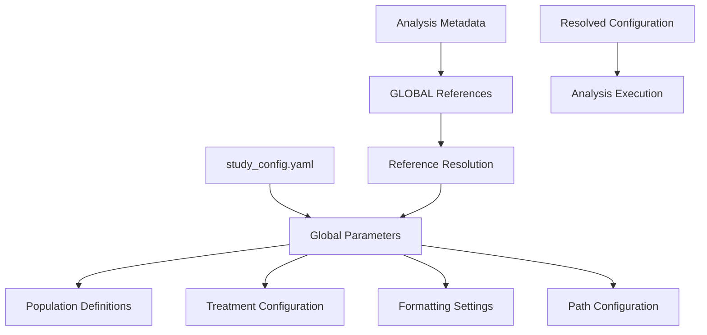
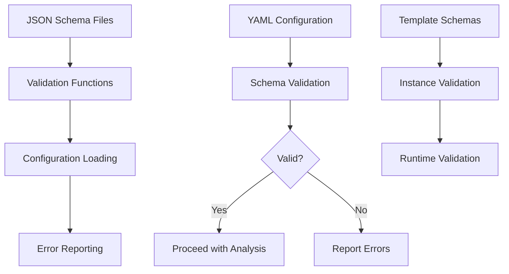

# AutoRTLF File Dependencies
AutoRTLF Development Team (Kan Li, Cursor) 2025-10-16


## Table of Contents
1. [Overview](#overview)
2. [Dependency Hierarchy](#dependency-hierarchy)
3. [Core Function Dependencies](#core-function-dependencies)
4. [Configuration Dependencies](#configuration-dependencies)
5. [Data Dependencies](#data-dependencies)
6. [Output Dependencies](#output-dependencies)
7. [Execution Dependencies](#execution-dependencies)
8. [Schema Dependencies](#schema-dependencies)
9. [Development Dependencies](#development-dependencies)
10. [Troubleshooting Dependencies](#troubleshooting-dependencies)

## Overview

This document provides a comprehensive mapping of file dependencies in the AutoRTLF v3 system. Understanding these dependencies is crucial for:

- **Development**: Adding new features without breaking existing functionality
- **Debugging**: Tracing issues through the dependency chain
- **Deployment**: Ensuring all required files are present in target environments
- **Maintenance**: Understanding impact of changes across the system

### Dependency Types

1. **Direct Dependencies**: Files that directly source or require other files
2. **Indirect Dependencies**: Files that depend on others through intermediate files
3. **Data Dependencies**: Files that require specific datasets or data structures
4. **Configuration Dependencies**: Files that require specific configuration parameters
5. **Schema Dependencies**: Files that must conform to specific JSON schemas

## Dependency Hierarchy

### Level 1: Foundation Files (No Dependencies)

These files form the foundation and have minimal external dependencies:

```
metadatalib/lib_config/study_config.schema.json
metadatalib/lib_analysis/baseline0char.schema.json
metadatalib/lib_analysis/ae0specific.schema.json
dataadam/adsl.rda
dataadam/adae.rda
```

### Level 2: Global Utilities

```
function/global/setup_functions.R
├── Depends on: [R base packages]
├── Uses: jsonlite, yaml, rlang
└── Provides: Configuration loading, path resolution, GLOBAL reference resolution

function/global/statistical_functions.R
├── Depends on: [R base packages]
├── Uses: dplyr, tidyr
└── Provides: Statistical calculations, formatting functions
```

### Level 3: Configuration Files

```
pgconfig/metadata/study_config.yaml
├── Schema: metadatalib/lib_config/study_config.schema.json
├── Provides: Global study parameters
└── Used by: All analysis functions

metadatalib/lib_config/study_config.yaml
├── Schema: metadatalib/lib_config/study_config.schema.json
├── Type: Template
└── Used by: Study-specific configurations
```

### Level 4: Analysis Templates

```
metadatalib/lib_analysis/baseline0char.yaml
├── Schema: metadatalib/lib_analysis/baseline0char.schema.json
├── References: GLOBAL.* parameters from study_config.yaml
├── Type: Template
└── Used by: Baseline analysis instances

metadatalib/lib_analysis/ae0specific.yaml
├── Schema: metadatalib/lib_analysis/ae0specific.schema.json
├── References: GLOBAL.* parameters from study_config.yaml
├── Type: Template
└── Used by: AE analysis instances
```

### Level 5: Analysis Instances

```
pganalysis/metadata/baseline0char0itt.yaml
├── Schema: metadatalib/lib_analysis/baseline0char.schema.json
├── Template: metadatalib/lib_analysis/baseline0char.yaml
├── References: GLOBAL.* parameters from pgconfig/metadata/study_config.yaml
└── Used by: pganalysis/run_baseline0char.R

pganalysis/metadata/ae0specific0soc05.yaml
├── Schema: metadatalib/lib_analysis/ae0specific.schema.json
├── Template: metadatalib/lib_analysis/ae0specific.yaml
├── References: GLOBAL.* parameters from pgconfig/metadata/study_config.yaml
└── Used by: pganalysis/run_ae0specific.R
```

### Level 6: Analysis Functions

```
function/standard/baseline0char.R
├── Sources: function/global/setup_functions.R
├── Sources: function/global/statistical_functions.R
├── Uses: dplyr, tidyr, rlang, r2rtf, jsonlite, yaml
├── Reads: pgconfig/metadata/study_config.yaml
├── Reads: Analysis metadata (*.yaml)
├── Reads: dataadam/adsl.rda
└── Generates: RTF, RDS, CSV, JSON, LOG files

function/standard/ae0specific.R
├── Sources: function/global/setup_functions.R
├── Sources: function/global/statistical_functions.R
├── Uses: dplyr, tidyr, rlang, r2rtf, jsonlite, yaml
├── Reads: pgconfig/metadata/study_config.yaml
├── Reads: Analysis metadata (*.yaml)
├── Reads: dataadam/adsl.rda, dataadam/adae.rda
└── Generates: RTF, RDS, CSV, JSON, LOG files
```

### Level 7: CLI Runners

```
pganalysis/run_baseline0char.R
├── Sources: function/standard/baseline0char.R
├── Uses: optparse (for command-line arguments)
├── Reads: Command-line arguments
└── Executes: Complete baseline analysis pipeline

pganalysis/run_ae0specific.R
├── Sources: function/standard/ae0specific.R
├── Uses: optparse (for command-line arguments)
├── Reads: Command-line arguments
└── Executes: Complete AE analysis pipeline
```

### Level 8: Batch Processing

```
generate_batch_commands.R
├── Uses: yaml, base R
├── Reads: pganalysis/metadata/*.yaml
├── Reads: pgconfig/metadata/study_config.yaml
└── Generates: batch_commands.txt

run_batch_parallel.ps1
├── Reads: batch_commands.txt
├── Executes: Multiple CLI runners in parallel
└── Depends on: PowerShell, Rscript in PATH

run_batch_sequential.ps1
├── Reads: batch_commands.txt
├── Executes: Multiple CLI runners sequentially
└── Depends on: PowerShell, Rscript in PATH
```

## Core Function Dependencies

### setup_functions.R Dependencies

```r
# R Package Dependencies
library(jsonlite)  # JSON parsing and generation
library(yaml)      # YAML file parsing
library(rlang)     # Non-standard evaluation

# Function Dependencies (within file)
setup_tlf_environment()
├── load_global_config()
├── resolve_value()
└── Returns: Validated metadata and global config

load_global_config()
├── yaml::read_yaml()
├── file.path() operations
└── Returns: Global configuration with resolved paths

resolve_value()
├── Recursive function for GLOBAL.* resolution
├── String manipulation functions
└── Returns: Resolved configuration values
```

### statistical_functions.R Dependencies

```r
# R Package Dependencies
library(dplyr)     # Data manipulation
library(tidyr)     # Data reshaping

# Function Dependencies
calculate_continuous_stats()
├── mean(), sd(), median(), min(), max()
├── round() for decimal formatting
└── Returns: List of statistical measures

calculate_categorical_stats()
├── table() for frequency counts
├── Percentage calculations
└── Returns: Data frame with counts and percentages

format_n_percent()
├── sprintf() for formatting
├── Percentage calculations
└── Returns: Formatted "N (XX.X%)" strings
```

### baseline0char.R Dependencies

```r
# R Package Dependencies
library(dplyr)     # Data manipulation
library(tidyr)     # Data reshaping
library(rlang)     # Non-standard evaluation
library(r2rtf)     # RTF generation
library(jsonlite)  # JSON operations
library(yaml)      # YAML parsing

# File Dependencies
source("function/global/setup_functions.R")
source("function/global/statistical_functions.R")

# Function Call Chain
run_baseline_analysis()
├── setup_tlf_environment()
├── load_analysis_dataset()
├── apply_population_filter()
├── build_baseline_table()
│   ├── process_continuous_variable()
│   └── process_categorical_variable()
├── generate_baseline_rtf()
└── save_intermediate_data()

# Data Dependencies
├── Requires: dataadam/adsl.rda
├── Configuration: pgconfig/metadata/study_config.yaml
└── Metadata: pganalysis/metadata/baseline*.yaml
```

### ae0specific.R Dependencies

```r
# R Package Dependencies
library(dplyr)     # Data manipulation
library(tidyr)     # Data reshaping
library(rlang)     # Non-standard evaluation
library(r2rtf)     # RTF generation
library(jsonlite)  # JSON operations
library(yaml)      # YAML parsing

# File Dependencies
source("function/global/setup_functions.R")
source("function/global/statistical_functions.R")

# Function Call Chain
run_ae_analysis()
├── setup_tlf_environment()
├── load_analysis_dataset() [ADSL]
├── load_analysis_dataset() [ADAE]
├── apply_population_filter() [both datasets]
├── build_ae_summary_table()
│   ├── calculate_ae_statistics()
│   ├── apply_threshold_filter()
│   └── apply_enhanced_grouping_and_sorting()
├── generate_ae_rtf()
└── save_ae_intermediate_data()

# Data Dependencies
├── Requires: dataadam/adsl.rda, dataadam/adae.rda
├── Configuration: pgconfig/metadata/study_config.yaml
└── Metadata: pganalysis/metadata/ae*.yaml
```

## Configuration Dependencies

### Global Configuration Resolution Chain



### Configuration File Dependencies

#### study_config.yaml Structure Dependencies
```yaml
# Required sections (order matters for some references)
study_info:          # Must be first (used in path resolution)
paths:               # Must be early (used throughout)
datasets:            # Used by data loading functions
treatment_config:    # Used by analysis functions
population:          # Used by filtering functions
formatting:          # Used by output functions
```

#### Analysis Metadata Dependencies
```yaml
# Required fields (validated by schema)
type:                # Must be "Table"
rfunction:           # Must match available function names
table_id:            # Must follow pattern validation
rename_output:       # Must be valid filename
population_from:     # Must exist in datasets configuration
variables:           # Must reference valid dataset variables

# Optional GLOBAL references
population_filter:   # Can reference GLOBAL.population.*
treatment_var:       # Can reference GLOBAL.treatment_config.*
decimals:           # Can reference GLOBAL.formatting.*
```

## Data Dependencies

### Dataset Requirements

#### ADSL (Subject-Level Analysis Dataset)
```r
# Required variables for baseline analysis
AGE                  # Continuous variable for age analysis
SEX                  # Categorical variable for demographics
RACE                 # Categorical variable for demographics
TRT01P               # Planned treatment (randomization)
TRT01PN              # Planned treatment (numeric)
TRT01A               # Actual treatment
TRT01AN              # Actual treatment (numeric)
SAFFL                # Safety population flag
ITTFL                # ITT population flag (if used)
RANDFL               # Randomization flag (if used)

# Optional variables (configurable)
WEIGHT               # Additional continuous variables
HEIGHT               # Additional continuous variables
BMI                  # Derived continuous variables
REGION               # Additional categorical variables
```

#### ADAE (Adverse Events Analysis Dataset)
```r
# Required variables for AE analysis
USUBJID              # Subject identifier (for merging)
AEDECOD              # Preferred term
AEBODSYS             # Body system
AESOC                # System organ class
AESEV                # Severity
AESER                # Serious flag
AREL                 # Relationship to treatment
TRTEMFL              # Treatment-emergent flag
SAFFL                # Safety population flag (if not merged from ADSL)

# Treatment variables (if not merged from ADSL)
TRT01A               # Actual treatment
TRT01AN              # Actual treatment (numeric)
```

### Data Loading Dependencies

```r
# Data loading function dependencies
load_analysis_dataset()
├── Requires: global_config$paths$dataadam_path
├── Requires: global_config$datasets[dataset_name]
├── File format: .rda files with matching object names
└── Returns: data.frame with expected variables

# Example data loading chain
dataadam/adsl.rda
├── Contains: adsl object (data.frame)
├── Loaded by: load("dataadam/adsl.rda")
├── Accessed as: adsl
└── Used by: All analysis functions
```

## Output Dependencies

### Output Directory Structure

```
# Project-based output organization
outtable/[project_name]/
├── [rename_output].rtf         # Primary RTF output
└── ...

outdata/[project_name]/
├── [rename_output].rds         # R binary format
├── [rename_output].csv         # CSV format
├── [rename_output]_info.json   # Execution metadata
└── ...

outlog/[project_name]/
├── [rename_output].log         # Detailed execution log
└── ...
```

### Output Generation Dependencies

```r
# RTF generation dependencies
generate_baseline_rtf()
├── Requires: r2rtf package
├── Requires: processed analysis results
├── Requires: global_config$formatting$rtf_settings
├── Requires: meta$title, meta$subtitle, meta$footnotes
└── Generates: [project]/[rename_output].rtf

# Data persistence dependencies
save_intermediate_data()
├── Requires: global_config$paths$outdata_path
├── Requires: global_config$study_info$project
├── Requires: meta$rename_output
├── Generates: [project]/[rename_output].rds
├── Generates: [project]/[rename_output].csv
└── Generates: [project]/[rename_output]_info.json
```

## Execution Dependencies

### CLI Runner Dependencies

```bash
# Command-line execution requirements
Rscript pganalysis/run_baseline0char.R [metadata] [config]

# System dependencies
├── R installation (4.0+)
├── Rscript in system PATH
├── Required R packages installed
└── Proper file permissions

# File dependencies
├── pganalysis/run_baseline0char.R exists
├── function/standard/baseline0char.R exists
├── function/global/*.R exist
├── Metadata file exists and is valid
├── Configuration file exists and is valid
└── Required datasets exist
```

### Batch Processing Dependencies

```powershell
# Batch command generation
Rscript generate_batch_commands.R
├── Requires: yaml package
├── Requires: pganalysis/metadata/*.yaml files
├── Requires: pgconfig/metadata/study_config.yaml
└── Generates: batch_commands.txt

# Parallel execution
.\run_batch_parallel.ps1
├── Requires: PowerShell 5.0+
├── Requires: batch_commands.txt
├── Requires: Rscript in PATH
└── Executes: Multiple R processes
```

## Schema Dependencies

### Schema Validation Chain



### Schema File Dependencies

```json
// Schema dependency hierarchy
metadatalib/lib_config/study_config.schema.json
├── Validates: pgconfig/metadata/study_config.yaml
├── Validates: metadatalib/lib_config/study_config.yaml
└── Used by: setup_tlf_environment()

metadatalib/lib_analysis/baseline0char.schema.json
├── Validates: pganalysis/metadata/baseline*.yaml
├── Validates: metadatalib/lib_analysis/baseline0char.yaml
└── Used by: setup_tlf_environment()

metadatalib/lib_analysis/ae0specific.schema.json
├── Validates: pganalysis/metadata/ae*.yaml
├── Validates: metadatalib/lib_analysis/ae0specific.yaml
└── Used by: setup_tlf_environment()
```

## Development Dependencies

### R Package Dependencies

```r
# Core packages (required for all functions)
library(dplyr)       # Data manipulation
library(tidyr)       # Data reshaping
library(rlang)       # Non-standard evaluation
library(yaml)        # YAML parsing
library(jsonlite)    # JSON operations

# Analysis-specific packages
library(r2rtf)       # RTF generation
library(optparse)    # Command-line parsing (CLI runners only)

# Optional packages (for enhanced functionality)
library(jsonvalidate) # Schema validation (if available)
library(stringr)      # String manipulation (some functions)
```

### Development Environment Dependencies

```r
# R version requirements
R >= 4.0.0           # Minimum R version

# System requirements
├── Sufficient memory (>= 4GB recommended)
├── Disk space for outputs
├── File system permissions
└── Network access (for package installation)

# Development tools (optional)
├── RStudio or similar IDE
├── Git for version control
├── JSON Schema validator
└── YAML syntax validator
```

## Troubleshooting Dependencies

### Common Dependency Issues

#### 1. Missing R Packages
```r
# Error: there is no package called 'dplyr'
# Solution: Install required packages
install.packages(c("dplyr", "tidyr", "rlang", "yaml", "jsonlite", "r2rtf"))
```

#### 2. File Not Found Errors
```r
# Error: cannot open file 'function/global/setup_functions.R'
# Check: Working directory and file paths
getwd()  # Should be in project root
file.exists("function/global/setup_functions.R")  # Should be TRUE
```

#### 3. Dataset Loading Issues
```r
# Error: Dataset file not found: dataadam/adsl.rda
# Check: Dataset file existence and configuration
file.exists("dataadam/adsl.rda")  # Should be TRUE
# Check: study_config.yaml paths configuration
```

#### 4. Schema Validation Failures
```r
# Error: Validation failed - missing required field
# Check: YAML syntax and required fields
yaml::read_yaml("pganalysis/metadata/baseline0char0itt.yaml")
# Validate against schema manually
```

#### 5. GLOBAL Reference Resolution Issues
```r
# Error: Could not resolve GLOBAL reference
# Check: Reference path exists in study_config.yaml
# Check: Proper nesting structure in configuration
```

### Dependency Verification Script

```r
# Verify all dependencies
verify_dependencies <- function() {
  
  # Check R packages
  required_packages <- c("dplyr", "tidyr", "rlang", "yaml", "jsonlite", "r2rtf")
  missing_packages <- setdiff(required_packages, installed.packages()[,1])
  if (length(missing_packages) > 0) {
    cat("Missing packages:", paste(missing_packages, collapse = ", "), "\n")
  }
  
  # Check core files
  core_files <- c(
    "function/global/setup_functions.R",
    "function/global/statistical_functions.R",
    "function/standard/baseline0char.R",
    "function/standard/ae0specific.R",
    "pgconfig/metadata/study_config.yaml"
  )
  
  missing_files <- core_files[!file.exists(core_files)]
  if (length(missing_files) > 0) {
    cat("Missing files:", paste(missing_files, collapse = ", "), "\n")
  }
  
  # Check datasets
  datasets <- c("dataadam/adsl.rda", "dataadam/adae.rda")
  missing_datasets <- datasets[!file.exists(datasets)]
  if (length(missing_datasets) > 0) {
    cat("Missing datasets:", paste(missing_datasets, collapse = ", "), "\n")
  }
  
  cat("Dependency verification complete.\n")
}
```

This comprehensive dependency mapping ensures reliable system operation and facilitates troubleshooting when issues arise. Understanding these dependencies is essential for successful development, deployment, and maintenance of the AutoRTLF system.
