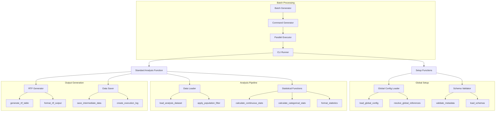
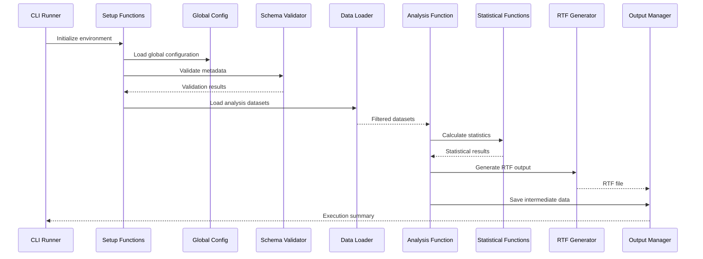
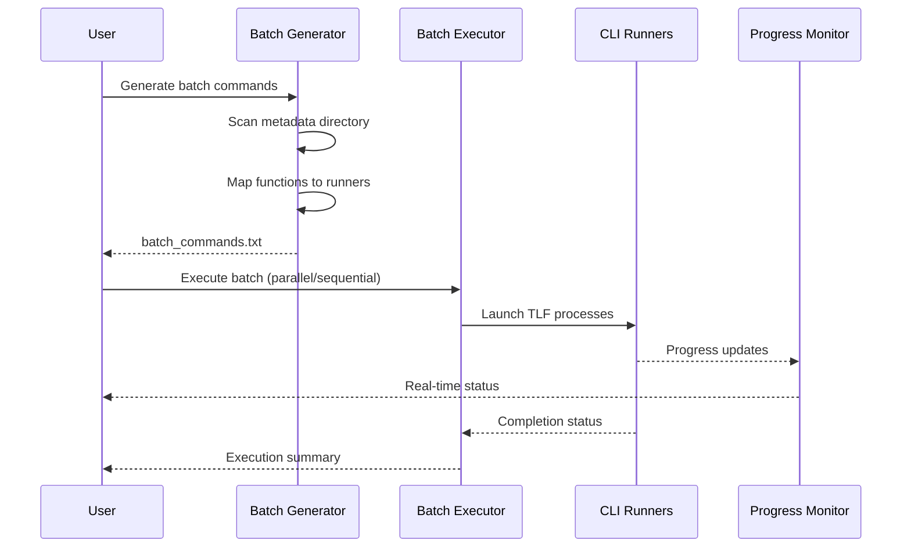

# AutoRTLF Project Architecture
AutoRTLF Development Team (Kan Li, Cursor) 2025-10-16

## Table of Contents
1. [Overview](#overview)
2. [Project Structure](#project-structure)
3. [Core Components](#core-components)
4. [Function Dependencies](#function-dependencies)
5. [Data Flow Architecture](#data-flow-architecture)
6. [Configuration System](#configuration-system)
7. [Execution Framework](#execution-framework)
8. [Output Management](#output-management)
9. [Schema Validation System](#schema-validation-system)
10. [Extensibility Framework](#extensibility-framework)

## Overview

AutoRTLF is a metadata-driven R framework for generating clinical trial Tables, Listings, and Figures (TLFs). The architecture represents a significant evolution from previous versions, featuring:

### Key Architectural Improvements in this version


### Core Design Principles

1. **Metadata-Driven Configuration**: All analysis parameters externalized in YAML files. 
2. **Template-Based Development**: Reusable templates for rapid TLF creation
3. **Schema-Validated Inputs**: JSON Schema validation ensures configuration correctness
4. **Modular Function Design**: Self-contained analysis functions with clear interfaces
5. **Scalable Execution**: Support for single-table and batch processing modesnand parallel execution capabilities
6.**Comprehensive Logging**: Detailed execution tracking and intermediate data storage
7. **Environment Agnostic**: Portable across development, testing, and production environments


## Project Structure

```
/
├── dataadam/                          # ADaM Analysis Datasets
│   ├── adsl.rda                      # Subject-Level Analysis Dataset
│   └── adae.rda                      # Adverse Events Analysis Dataset
├── datasdtm/                         # SDTM Source Datasets (if needed)
├── function/                         # R Function Library
│   ├── global/                       # Global utility functions
│   │   ├── setup_functions.R         # Environment setup and configuration
│   │   └── statistical_functions.R   # Reusable statistical calculations
│   ├── standard/                     # Standard TLF analysis functions
│   │   ├── baseline0char.R           # Baseline characteristics (consolidated)
│   │   └── ae0specific.R             # Adverse events specific (consolidated)
│   └── study/                        # Study-specific custom functions
├── metadatalib/                      # Metadata Template Library
│   ├── lib_analysis/                 # Analysis templates
│   │   ├── baseline0char.yaml        # Baseline characteristics template
│   │   ├── baseline0char.schema.json # Baseline validation schema
│   │   ├── ae0specific.yaml          # AE specific template
│   │   └── ae0specific.schema.json   # AE specific validation schema
│   ├── lib_config/                   # Configuration templates
│   │   ├── study_config.yaml         # Global study configuration template
│   │   └── study_config.schema.json  # Study config validation schema
│   └── SCHEMA_DOCUMENTATION.md       # Schema usage documentation
├── pganalysis/                       # Analysis Program Directory
│   ├── metadata/                     # Analysis metadata instances
│   │   ├── baseline0char0itt.yaml    # ITT baseline table
│   │   ├── baseline0char0white.yaml  # Race subgroup baseline
│   │   ├── ae0specific0soc05.yaml    # AE by SOC (5% threshold)
│   │   └── ae0specific0dec0sae01.yaml # Serious AE by decreasing incidence
│   ├── run_baseline0char.R           # Baseline CLI runner
│   └── run_ae0specific.R             # AE specific CLI runner
├── pgconfig/                         # Configuration Program Directory
│   └── metadata/                     # Configuration instances
│       └── study_config.yaml         # Study-specific global configuration
├── outdata/                          # Intermediate Analysis Data
│   └── [project]/                    # Project-specific subdirectories
│       ├── *.rds                     # R binary data files
│       ├── *.csv                     # CSV data files
│       └── *_info.json               # Execution metadata
├── outtable/                         # Generated RTF Tables
│   └── [project]/                    # Project-specific subdirectories
│       └── *.rtf                     # RTF output files
├── outgraph/                         # Generated Figures (future)
├── outlist/                          # Generated Listings (future)
├── outlog/                           # Execution Logs
│   └── [project]/                    # Project-specific subdirectories
│       └── *.log                     # Detailed execution logs
├── generate_batch_commands.R         # Batch command generator
├── run_batch_parallel.ps1            # Parallel execution script
├── run_batch_sequential.ps1          # Sequential execution script
├── batch_commands.txt                # Generated batch commands
├── validate_schemas.R                # Schema validation utility
├── test_schemas.R                    # Schema testing utility
└── TLF_DEVELOPMENT_GUIDE.md          # Developer documentation
```

## Core Components

### 1. Metadata Library System (`metadatalib/`)

The metadata library serves as the foundation for all TLF configurations:

#### Template Structure
- **`lib_analysis/`**: Analysis-specific templates (baseline, AE, efficacy, etc.)
- **`lib_config/`**: Global configuration templates (study settings, paths, populations)
- **JSON Schemas**: Validation schemas for each template type

#### Key Features
- **Template Inheritance**: New TLFs inherit from proven templates
- **Schema Validation**: Automatic validation of configuration correctness
- **Global References**: Support for `GLOBAL.path.to.parameter` references
- **Documentation Integration**: Self-documenting schemas with field descriptions

### 2. Consolidated Function Architecture (`function/`)

#### Global Functions (`function/global/`)
- **`setup_functions.R`**: Environment setup, configuration loading, path resolution
- **`statistical_functions.R`**: Reusable statistical calculations (mean, median, CI, etc.)

#### Standard Functions (`function/standard/`)
Each TLF type has a single consolidated R file containing:
- **Setup and Configuration**: Environment initialization and parameter loading
- **Data Loading and Filtering**: Dataset loading and population filtering
- **Analysis Logic**: Statistical calculations and data processing
- **RTF Generation**: Output formatting and file creation
- **Data Persistence**: Intermediate data saving and logging

#### Study Functions (`function/study/`)
- Custom functions for study-specific analyses
- Extensions to standard templates
- Specialized statistical methods

### 3. Program Execution Framework (`pganalysis/`, `pgconfig/`)

#### Analysis Programs (`pganalysis/`)
- **Metadata Instances**: Customized configurations for specific TLFs
- **CLI Runners**: Command-line interfaces for individual TLF execution
- **Batch Integration**: Support for automated batch processing

#### Configuration Programs (`pgconfig/`)
- **Study Configuration**: Global study-level parameters
- **Environment Settings**: Paths, datasets, populations, formatting

### 4. Output Management System

#### Structured Output Organization
- **Project-based Directories**: All outputs organized by project identifier
- **Type-specific Folders**: Separate directories for tables, figures, listings, data, logs
- **Consistent Naming**: Standardized file naming based on `rename_output` parameter

#### Output Types
- **RTF Tables**: Publication-ready formatted tables
- **Intermediate Data**: Analysis results in R and CSV formats
- **Execution Logs**: Detailed processing logs with system information
- **Metadata Files**: Run information and parameter tracking

## Function Dependencies



### Dependency Layers

1. **Foundation Layer**: Global utilities, configuration management, schema validation
2. **Data Layer**: Dataset loading, filtering, validation
3. **Analysis Layer**: Statistical calculations, data processing, result formatting
4. **Output Layer**: RTF generation, data persistence, logging
5. **Orchestration Layer**: CLI interfaces, batch processing, execution management

## Data Flow Architecture

### Single TLF Execution Flow



### Batch Processing Flow



## Configuration System

### Global Reference Resolution

The architecture implements a sophisticated global reference system:

#### Reference Syntax
```yaml
# In analysis metadata
population_filter: GLOBAL.population.SAFETY.filter_expression
treatment_var: GLOBAL.treatment_config.treatment_actual_var
decimals: GLOBAL.formatting.decimals.continuous

# Resolves to values from study_config.yaml
population:
  SAFETY:
    filter_expression: 'SAFFL == "Y"'
treatment_config:
  treatment_actual_var: "TRT01A"
formatting:
  decimals:
    continuous: 1
```

#### Resolution Process
1. **Template Loading**: Load analysis metadata with GLOBAL references
2. **Config Loading**: Load global study configuration
3. **Reference Resolution**: Replace GLOBAL.* strings with actual values
4. **Validation**: Validate resolved configuration against schema
5. **Execution**: Proceed with resolved parameters

### Configuration Hierarchy

1. **Global Configuration** (`pgconfig/metadata/study_config.yaml`)
   - Study information, paths, datasets
   - Treatment configurations, populations
   - Formatting settings, RTF parameters

2. **Template Configuration** (`metadatalib/lib_analysis/*.yaml`)
   - Analysis-specific parameter templates
   - Default values and common configurations
   - Schema-validated structure

3. **Instance Configuration** (`pganalysis/metadata/*.yaml`)
   - Specific TLF customizations
   - Override template defaults
   - Study-specific adaptations

## Execution Framework

### Command-Line Interface

Each TLF type has a dedicated CLI runner with standardized interface:

```bash
# Standard execution pattern
Rscript pganalysis/run_[function_name].R [metadata_file] [config_file]

# Examples
Rscript pganalysis/run_baseline0char.R pganalysis/metadata/baseline0char0itt.yaml pgconfig/metadata/study_config.yaml
Rscript pganalysis/run_ae0specific.R pganalysis/metadata/ae0specific0soc05.yaml pgconfig/metadata/study_config.yaml
```

### Batch Processing System

#### Command Generation
```bash
# Generate all batch commands
Rscript generate_batch_commands.R

# Creates batch_commands.txt with individual commands
```

#### Execution Options
```powershell
# Parallel execution (recommended for production)
.\run_batch_parallel.ps1 -MaxParallel 4

# Sequential execution (recommended for debugging)
.\run_batch_sequential.ps1

# Custom commands file
.\run_batch_parallel.ps1 -CommandsFile custom_commands.txt
```

### Error Handling and Recovery

#### Validation Layers
1. **Schema Validation**: Metadata structure and type checking
2. **Data Validation**: Dataset existence and variable checking
3. **Configuration Validation**: Parameter consistency and completeness
4. **Runtime Validation**: Execution environment and resource checking

#### Error Recovery
- **Graceful Degradation**: Continue batch processing despite individual failures
- **Detailed Logging**: Comprehensive error reporting with context
- **Retry Mechanisms**: Automatic retry for transient failures
- **Rollback Capabilities**: Clean up partial outputs on failure

## Output Management

### File Organization Strategy

#### Project-Based Organization
```
outtable/[project_name]/
├── baseline0char0itt.rtf
├── baseline0char0white.rtf
├── ae0specific0soc05.rtf
└── ae0specific0dec0sae01.rtf

outdata/[project_name]/
├── baseline0char0itt.rds
├── baseline0char0itt.csv
├── baseline0char0itt_info.json
└── ...
```

#### Naming Conventions
- **RTF Files**: `[rename_output].rtf`
- **Data Files**: `[rename_output].[format]`
- **Log Files**: `[rename_output].log`
- **Metadata Files**: `[rename_output]_info.json`

### Output Content Standards

#### RTF Tables
- **Professional Formatting**: Publication-ready appearance
- **Consistent Styling**: Standardized fonts, spacing, borders
- **Regulatory Compliance**: FDA/EMA formatting guidelines
- **Accessibility**: Screen reader compatible structure

#### Intermediate Data
- **Multiple Formats**: RDS (R native), CSV (universal)
- **Metadata Preservation**: Variable labels, formats, derivations
- **Audit Trail**: Processing steps and parameters
- **Version Control**: File hashes and timestamps

#### Execution Logs
- **Comprehensive Information**: System details, package versions, execution time
- **Error Tracking**: Detailed error messages and stack traces
- **Performance Metrics**: Memory usage, processing time, data volumes
- **Reproducibility**: Complete parameter sets and environment details

## Schema Validation System

### Validation Architecture

#### Schema Types
1. **Study Configuration Schema**: Validates global study parameters
2. **Analysis Template Schemas**: Validates TLF-specific configurations
3. **Cross-Reference Validation**: Ensures GLOBAL references are valid

#### Validation Process
```r
# Automatic validation in setup process
setup_results <- setup_tlf_environment(metadata_file, global_config_file)
# Returns validated and resolved configurations
```

#### Validation Features
- **Type Safety**: Ensures correct data types for all parameters
- **Required Fields**: Validates presence of mandatory configuration
- **Pattern Matching**: Validates formats (dates, IDs, file names)
- **Range Checking**: Validates numeric ranges and constraints
- **Conditional Logic**: Context-dependent validation rules

### Schema Integration

#### Development Integration
- **IDE Support**: Auto-completion and real-time validation
- **Pre-commit Hooks**: Automatic validation before code commits
- **CI/CD Integration**: Validation in automated testing pipelines

#### Runtime Integration
- **Startup Validation**: Configuration validation before analysis
- **Error Prevention**: Early detection of configuration issues
- **User Feedback**: Clear error messages with correction guidance

## Extensibility Framework

### Adding New TLF Types

#### Template Development Process
1. **Requirements Analysis**: Define analysis objectives and data requirements
2. **Schema Design**: Create JSON schema for new TLF type
3. **Function Implementation**: Develop consolidated analysis function
4. **Template Creation**: Create metadata template with examples
5. **CLI Integration**: Implement command-line runner
6. **Testing**: Validate with sample data and edge cases
7. **Documentation**: Update guides and examples

#### Extension Points
- **Statistical Functions**: Add new calculations to `statistical_functions.R`
- **Output Formats**: Extend RTF formatting capabilities
- **Data Sources**: Support for new dataset types and structures
- **Validation Rules**: Custom validation logic for specialized requirements

### Customization Capabilities

#### Study-Level Customization
- **Global Parameters**: Study-specific settings in `study_config.yaml`
- **Custom Functions**: Study-specific logic in `function/study/`
- **Template Overrides**: Study-specific template modifications

#### Analysis-Level Customization
- **Parameter Overrides**: Instance-specific parameter modifications
- **Variable Mappings**: Custom variable names and derivations
- **Output Formatting**: Table-specific formatting requirements

### Integration Capabilities

#### External System Integration
- **Database Connectivity**: Direct database access for large datasets
- **API Integration**: RESTful API endpoints for remote execution
- **Workflow Systems**: Integration with clinical data management systems
- **Version Control**: Git-based configuration management

#### Technology Integration
- **Container Support**: Docker containerization for deployment
- **Cloud Platforms**: AWS/Azure/GCP execution environments
- **Parallel Computing**: HPC cluster integration
- **Monitoring Systems**: Integration with operational monitoring

---

## Architecture Benefits

### For Developers
- **Clear Structure**: Logical organization facilitates understanding
- **Modular Design**: Easy to modify and extend individual components
- **Schema Validation**: Prevents configuration errors during development
- **Comprehensive Logging**: Detailed debugging information

### For Users
- **Template-Based**: Quick TLF creation from proven templates
- **Batch Processing**: Efficient generation of multiple tables
- **Consistent Output**: Standardized formatting across all TLFs
- **Error Recovery**: Robust handling of execution issues

### For Organizations
- **Scalability**: Supports small studies to large clinical programs
- **Compliance**: Built-in regulatory formatting standards
- **Reproducibility**: Complete audit trail and version control
- **Portability**: Environment-agnostic execution capabilities

This architecture provides a solid foundation for clinical trial reporting while maintaining flexibility for future enhancements and organizational requirements.
