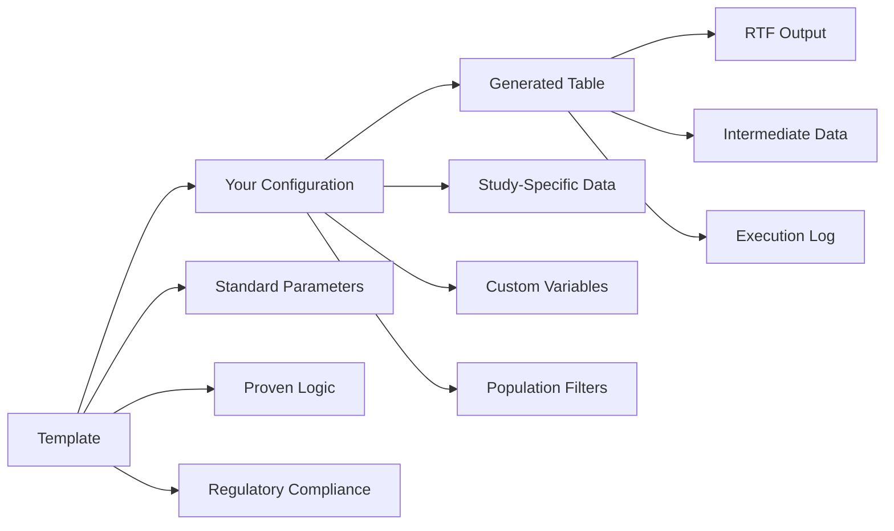
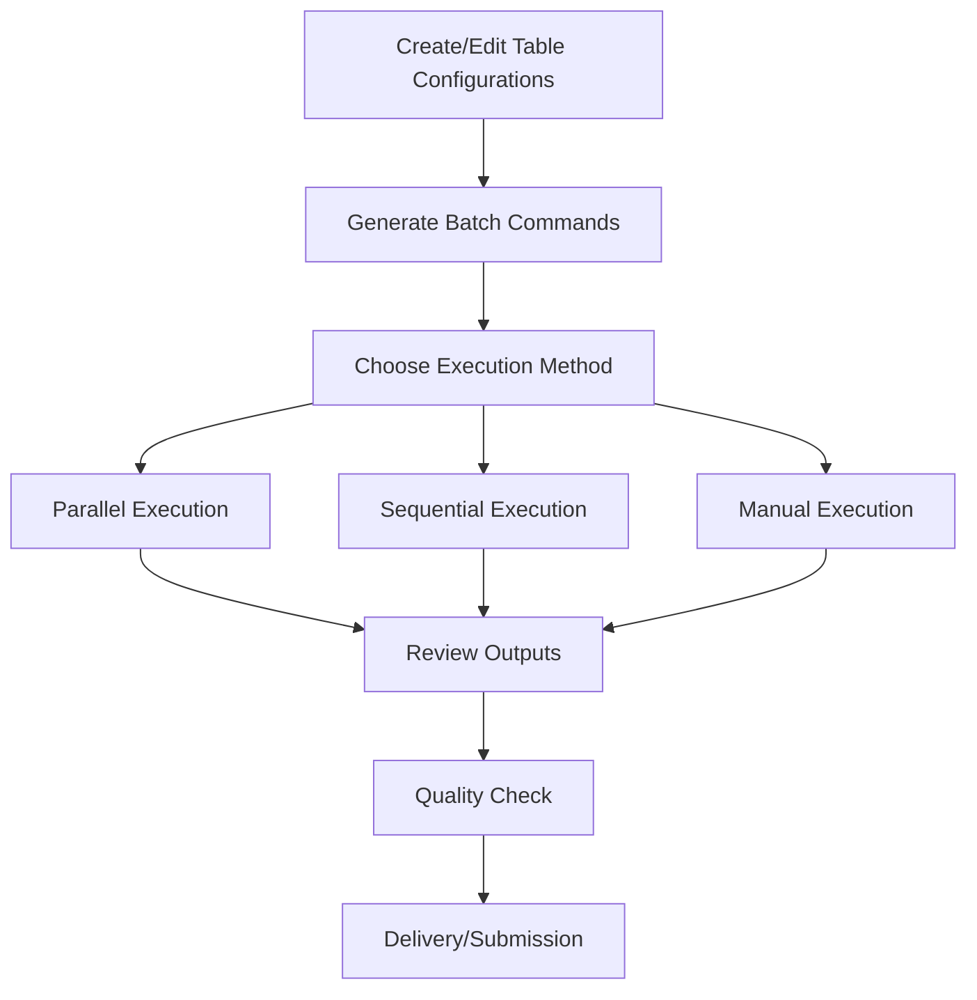

# AutoRTLF User Guide
AutoRTLF Development Team (Kan Li, Cursor) 2025-10-16

## Table of Contents
1. [Overview](#overview)
2. [Quick Start](#quick-start)
3. [Understanding the System](#understanding-the-system)
4. [Using Existing Templates](#using-existing-templates)
5. [Customizing Tables for Your Study](#customizing-tables-for-your-study)
6. [Batch Processing](#batch-processing)
7. [Output Management](#output-management)
8. [Common Use Cases](#common-use-cases)
9. [Troubleshooting](#troubleshooting)
10. [Advanced Usage](#advanced-usage)

## Overview

AutoRTLF is a powerful meta data driven system for generating clinical trial Tables, Listings, and Figures (TLFs) using predefined templates. As a user, you can:

- **Use existing templates** for common analyses (baseline characteristics, adverse events)
- **Customize templates** for your specific study requirements
- **Generate multiple tables** efficiently using batch processing
- **Produce publication-ready RTF outputs** that meet regulatory standards

### What You Need to Know

- **No R programming required** for basic usage
- **YAML configuration files** control all table parameters
- **Template-based approach** ensures consistency and quality
- **Batch processing** enables efficient generation of multiple tables

### System Requirements

- R 4.0+ installed with required packages
- Access to your study's ADaM datasets
- Basic understanding of YAML file editing

## Quick Start

### 5-Minute Setup

#### Step 1: Verify Your Environment
If on Windows, open the PowerShell,

```bash
# Navigate to your AutoRTLF v3 directory
cd /path/to/autortlf

# Verify R installation
Rscript --version
# Should show R version 4.0+
```

>If you are on Windows and the `Rscript` command is not recognized, it may not be in your system PATH. You can search for your R installation and add its path to your environment using PowerShell:
>
>```bash
># Search for R installation (commonly under Program Files)
>Get-ChildItem "C:\Program Files\R" -Recurse -Directory -ErrorAction SilentlyContinue | Where-Object { $_.Name -match "^R-[\d\.]+$" }
>
># Example: If R is installed in "C:\Program Files\R\R-4.2.2"
>$rPath = "C:\Program Files\R\R-4.2.2\bin"
>[System.Environment]::SetEnvironmentVariable("PATH", $env:PATH + ";$rPath", [System.EnvironmentVariableTarget]::User)
>
># Restart your terminal and try:
>Rscript --version
>```
>
>If Rscript still can't be found, locate it manually (usually under the `bin` folder of your R installation), and add its directory to your PATH as shown above. After updating, close and reopen your terminal or PowerShell window. Now `Rscript` commands should work.


#### Step 2: Configure Your Study
Edit the global study configuration:
```bash
# Open the study configuration file
# Windows: notepad pgconfig/metadata/study_config.yaml
# Mac/Linux: nano pgconfig/metadata/study_config.yaml
```

Update key settings:
```yaml
study_info:
  study_id: "YOUR-STUDY-ID"        # e.g., "ABC123-001"
  study_title: "Your Study Title"   # e.g., "Phase III Study of Drug X"
  project: "your-project-name"      # e.g., "ABC123-ia01"

paths:
  study_root: "/path/to/your/project"  # Update to your actual path
```

#### Step 3: Add Your Data
```bash
# Copy your ADaM datasets to the data directory
cp /path/to/your/adsl.rda dataadam/
cp /path/to/your/adae.rda dataadam/
# Add other datasets as needed
```

#### Step 4: Generate Your First Table
```bash
# Generate a baseline characteristics table
Rscript pganalysis/run_baseline0char.R pganalysis/metadata/baseline0char0itt.yaml pgconfig/metadata/study_config.yaml

# Check the output
ls outtable/your-project-name/
# Should see: baseline0char0itt.rtf
```

**Congratulations!** You've generated your first table. The RTF file is ready for review and submission.

## Understanding the System

### File Organization

```
autortlf-v3/
├── dataadam/                    # Your ADaM datasets go here
│   ├── adsl.rda                # Subject-level data
│   └── adae.rda                # Adverse events data
├── pgconfig/metadata/           # Study-specific configuration
│   └── study_config.yaml       # Global study settings
├── pganalysis/metadata/         # Table-specific configurations
│   ├── baseline0char0itt.yaml  # ITT baseline table
│   ├── baseline0char0white.yaml # Race subgroup baseline
│   └── ae0specific0soc05.yaml  # AE table (5% threshold)
├── outtable/[project]/         # Generated RTF tables
├── outdata/[project]/          # Intermediate data files
└── outlog/[project]/           # Execution logs
```

### Configuration Hierarchy

1. **Global Configuration** (`pgconfig/metadata/study_config.yaml`)
   - Study information, paths, treatment arms
   - Population definitions, formatting settings
   - Shared across all tables

2. **Table Configuration** (`pganalysis/metadata/*.yaml`)
   - Table-specific settings
   - Variable selections, filters, display options
   - One file per table

### Template System

AutoRTLF uses a template-based approach:



## Using Existing Templates

### Available Templates

#### Baseline Characteristics (`baseline0char`)
**Purpose**: Summarize demographic and baseline characteristics
**Typical Use**: Table in clinical study reports

**Features**:
- Continuous variables: N, Mean (SD), Median, Min-Max
- Categorical variables: N (%)
- Treatment group columns with optional Total column
- Flexible population filtering

#### Adverse Events Specific (`ae0specific`)
**Purpose**: Summarize adverse events by preferred term
**Typical Use**: Table in clinical study reports

**Features**:
- Incidence thresholds (e.g., ≥5% in any treatment group)
- Grouping by System Organ Class or other variables
- Advanced sorting options (frequency or alphabetical)
- Support for serious AEs, treatment-emergent AEs, etc.

### Using Templates Out-of-the-Box

Many existing configurations work immediately with minimal changes:

#### Example: ITT Baseline Table
```bash
# Use the existing ITT baseline configuration
Rscript pganalysis/run_baseline0char.R pganalysis/metadata/baseline0char0itt.yaml pgconfig/metadata/study_config.yaml
```

This generates a baseline characteristics table for the Intent-to-Treat population using standard variables (Age, Sex, Race).

#### Example: AE Summary (5% Threshold)
```bash
# Use the existing AE summary configuration
Rscript pganalysis/run_ae0specific.R pganalysis/metadata/ae0specific0soc05.yaml pgconfig/metadata/study_config.yaml
```

This generates an adverse events summary showing AEs with ≥5% incidence in any treatment group.

## Customizing Tables for Your Study

### Step 1: Copy an Existing Configuration

Start with a template that's closest to your needs:

```bash
# Copy baseline template for a new population
cp pganalysis/metadata/baseline0char0itt.yaml pganalysis/metadata/baseline0char0efficacy.yaml

# Copy AE template for different threshold
cp pganalysis/metadata/ae0specific0soc05.yaml pganalysis/metadata/ae0specific0soc01.yaml
```

### Step 2: Edit the Configuration

Open your copied file and customize:

#### Basic Table Information
```yaml
# Update table identity
table_id: "Table 14.1.1.2"
rename_output: "baseline0char0efficacy"  # This becomes your filename
title: "Baseline Characteristics - Efficacy Population"
subtitle: "(GLOBAL.population.EFFICACY.title)"
```

#### Population Selection
```yaml
# Change population filter
population_filter: 'EFFICFL == "Y"'  # Efficacy population

# Or reference a global population
population_filter: GLOBAL.population.EFFICACY.filter_expression
```

#### Variable Customization (Baseline Tables)
```yaml
variables:
  - name: "Age (years)"
    source_var: "AGE"
    type: "continuous"
  
  - name: "Sex"
    source_var: "SEX"
    type: "categorical"
    levels: ["M", "F"]
    label_overrides:
      M: "Male"
      F: "Female"
  
  # Add new variables
  - name: "Weight (kg)"
    source_var: "WEIGHT"
    type: "continuous"
  
  - name: "ECOG Performance Status"
    source_var: "ECOG"
    type: "categorical"
    levels: ["0", "1", "2"]
    label_overrides:
      "0": "Fully active"
      "1": "Restricted in physically strenuous activity"
      "2": "Ambulatory and capable of all selfcare"
```

#### AE Table Customization
```yaml
# Change incidence threshold
ae_parameters:
  min_subjects_threshold: 1.0  # 1% instead of 5%
  
  # Change grouping
  group_by_var: "AESEV"  # Group by severity instead of SOC
  group_display_name: "Severity"
  
  # Change sorting
  sort_options:
    sort_by: "alphabetical"  # Alphabetical instead of frequency
    sort_order: "asc"        # Ascending order
```

### Step 3: Test Your Configuration

```bash
# Test your customized table
Rscript pganalysis/run_baseline0char.R pganalysis/metadata/baseline0char0efficacy.yaml pgconfig/metadata/study_config.yaml

# Check the output
ls outtable/your-project-name/
# Should see: baseline0char0efficacy.rtf
```

### Common Customizations

#### Population Filters
```yaml
# Safety population
population_filter: 'SAFFL == "Y"'

# Intent-to-Treat population
population_filter: 'ITTFL == "Y"'

# Efficacy population
population_filter: 'EFFICFL == "Y"'

# Subgroup analysis (e.g., biomarker positive)
population_filter: 'SAFFL == "Y" & BIOMARKER == "POSITIVE"'

# Multiple conditions
population_filter: 'SAFFL == "Y" & AGE >= 18 & REGION == "US"'
```

#### Display Options
```yaml
display_options:
  display_mean: true          # Show mean for continuous variables
  display_median: true        # Show median
  display_range: true         # Show min-max range
  display_IQR: false          # Hide interquartile range
  display_total_column: true  # Show "Total" column
  display_only_total_column: false  # Show treatment groups too
```

#### Treatment Variables
```yaml
# Use planned treatment (randomization)
treatment_var: GLOBAL.treatment_config.treatment_random_var    # TRT01P

# Use actual treatment (what patient received)
treatment_var: GLOBAL.treatment_config.treatment_actual_var    # TRT01A
```

## Batch Processing

### Understanding Batch Processing

Instead of running tables one by one, you can generate all your tables at once using the batch system.

### Step 1: Generate Batch Commands

```bash
# Scan all your table configurations and create batch commands
Rscript generate_batch_commands.R
```

This creates `batch_commands.txt` with individual commands for each table:
```
# Command 1 - TLF: baseline0char0itt.yaml - Function: baseline0char
Rscript pganalysis/run_baseline0char.R pganalysis/metadata/baseline0char0itt.yaml pgconfig/metadata/study_config.yaml

# Command 2 - TLF: baseline0char0white.yaml - Function: baseline0char  
Rscript pganalysis/run_baseline0char.R pganalysis/metadata/baseline0char0white.yaml pgconfig/metadata/study_config.yaml

# Command 3 - TLF: ae0specific0soc05.yaml - Function: ae0specific
Rscript pganalysis/run_ae0specific.R pganalysis/metadata/ae0specific0soc05.yaml pgconfig/metadata/study_config.yaml
```

### Step 2: Execute Batch Processing

#### Option A: Parallel Execution (Recommended)
```powershell
# Run all tables in parallel (fastest)
.\run_batch_parallel.ps1

# Run with more parallel jobs for faster execution
.\run_batch_parallel.ps1 -MaxParallel 4

# Use custom commands file
.\run_batch_parallel.ps1 -CommandsFile my_custom_commands.txt
```

#### Option B: Sequential Execution (Safer for Debugging)
```powershell
# Run all tables one by one (most reliable)
.\run_batch_sequential.ps1

# Use custom commands file
.\run_batch_sequential.ps1 -CommandsFile my_custom_commands.txt
```

#### Option C: Manual Execution
```bash
# Copy and paste individual commands from batch_commands.txt
Rscript pganalysis/run_baseline0char.R pganalysis/metadata/baseline0char0itt.yaml pgconfig/metadata/study_config.yaml
Rscript pganalysis/run_ae0specific.R pganalysis/metadata/ae0specific0soc05.yaml pgconfig/metadata/study_config.yaml
# ... continue with remaining commands
```

### Batch Processing Workflow



### Expected Execution Times

- **Individual Table**: 4-6 seconds
- **5 Tables Sequential**: 20-30 seconds
- **5 Tables Parallel (2 jobs)**: 12-15 seconds  
- **5 Tables Parallel (4 jobs)**: 8-10 seconds

## Output Management

### Output Structure

All outputs are organized by project:

```
outtable/your-project-name/
├── baseline0char0itt.rtf           # ITT baseline table
├── baseline0char0white.rtf         # Race subgroup baseline
├── ae0specific0soc05.rtf          # AE summary (5% threshold)
└── ae0specific0dec0sae01.rtf      # Serious AE summary

outdata/your-project-name/
├── baseline0char0itt.rds          # R data format
├── baseline0char0itt.csv          # Or CSV format
└── ...

outlog/your-project-name/
├── baseline0char0itt.log          # Detailed execution log
└── ...
```

### Output Files Explained

#### RTF Files (`outtable/`)
- **Purpose**: Publication-ready tables for regulatory submission
- **Format**: Rich Text Format (RTF) - opens in Word, SAS, etc.
- **Content**: Formatted table with titles, footnotes, proper spacing
- **Usage**: Include directly in clinical study reports

#### Data Files (`outdata/`)
- **RDS Files**: R binary format for further analysis
- **CSV Files**: Universal format for review and validation

#### Log Files (`outlog/`)
- **Content**: Detailed execution information
- **Includes**: System info, package versions, processing steps, any warnings
- **Usage**: Debugging, validation, audit trail

### Quality Checking Your Outputs

#### Visual Review
1. **Open RTF files** in Microsoft Word or similar
2. **Check formatting**: Titles, footnotes, alignment, spacing
3. **Verify content**: Numbers, percentages, treatment groups
4. **Compare with specifications**: Ensure requirements are met

#### Data Validation
```bash
# Review intermediate data
# Open CSV files in Excel or similar for data review
```

#### Log Review
```bash
# Check for warnings or errors
grep -i "warning\|error" outlog/your-project-name/*.log
```

## Common Use Cases
### About `metadatalib`

The `metadatalib` directory stores the YAML templates for each Table, Listing, or Figure (TLF) as well as the corresponding JSON schema files that validate them.

- **YAML templates**: Define the metadata and specifications for a given TLF (e.g., variable mappings, population filters, titles).
- **JSON schema**: Describes and validates the structure of the YAML templates, ensuring that each configuration file meets required standards.

For more details on how to author or modify a YAML template, or to explore required/optional fields, refer to document in `metadatalib/SCHEMA_DOCUMENTATION.md/`.  
This helps ensure consistency, correctness, and validation across all TLF metadata configurations.


### Validating Your YAML Configuration Files

Before running table generation, it is highly recommended to validate your YAML configuration files against their corresponding JSON schemas to ensure correctness and compliance.


```bash
# Validate a single YAML configuration file against its schema
Rscript pgconfig/validate_schemas.R 
```

The script will:
- Parse your YAML file
- Check it against the appropriate JSON schema in `metadatalib`
- Report errors or inconsistencies
- Help you quickly identify missing or invalid fields before running table generation


### Use Case 1: Standard Baseline Table

**Scenario**: Generate a standard baseline characteristics table for the safety population.

**Steps**:
1. Use existing configuration: `baseline0char0itt.yaml`
2. Modify population if needed:
   ```yaml
   population_filter: 'SAFFL == "Y"'  # Safety population
   ```
3. Execute:
   ```bash
   Rscript pganalysis/run_baseline0char.R pganalysis/metadata/baseline0char0itt.yaml pgconfig/metadata/study_config.yaml
   ```

### Use Case 2: Subgroup Analysis

**Scenario**: Create baseline table for biomarker-positive patients only.

**Steps**:
1. Copy existing configuration:
   ```bash
   cp pganalysis/metadata/baseline0char0itt.yaml pganalysis/metadata/baseline0char0biomarker.yaml
   ```
2. Edit the new file:
   ```yaml
   table_id: "Table 14.1.1.3"
   rename_output: "baseline0char0biomarker"
   title: "Baseline Characteristics - Biomarker Positive Population"
   population_filter: 'SAFFL == "Y" & BIOMARKER == "POSITIVE"'
   ```
3. Execute:
   ```bash
   Rscript pganalysis/run_baseline0char.R pganalysis/metadata/baseline0char0biomarker.yaml pgconfig/metadata/study_config.yaml
   ```

### Use Case 3: Multiple AE Tables with Different Thresholds

**Scenario**: Generate AE summaries with 5%, 1%, and 0% thresholds.

**Steps**:
1. Copy and customize configurations:
   ```bash
   cp pganalysis/metadata/ae0specific0soc05.yaml pganalysis/metadata/ae0specific0soc01.yaml
   cp pganalysis/metadata/ae0specific0soc05.yaml pganalysis/metadata/ae0specific0soc00.yaml
   ```

2. Edit thresholds:
   ```yaml
   # In ae0specific0soc01.yaml
   ae_parameters:
     min_subjects_threshold: 1.0  # 1%
   
   # In ae0specific0soc00.yaml  
   ae_parameters:
     min_subjects_threshold: 0.0  # 0% (all AEs)
   ```

3. Use batch processing:
   ```bash
   Rscript generate_batch_commands.R
   .\run_batch_parallel.ps1
   ```

### Use Case 4: Serious Adverse Events Only

**Scenario**: Generate a table showing only serious adverse events.

**Steps**:
1. Copy AE configuration:
   ```bash
   cp pganalysis/metadata/ae0specific0soc05.yaml pganalysis/metadata/ae0specific0serious.yaml
   ```

2. Modify for serious AEs:
   ```yaml
   title: "Participants With Serious Adverse Events"
   rename_output: "ae0specific0serious"
   observation_filter: 'TRTEMFL == "Y" & SAFFL == "Y" & AESER == "Y"'
   ae_parameters:
     min_subjects_threshold: 0.0  # Show all serious AEs
   ```

3. Execute:
   ```bash
   Rscript pganalysis/run_ae0specific.R pganalysis/metadata/ae0specific0serious.yaml pgconfig/metadata/study_config.yaml
   ```

### Use Case 5: Adding Custom Variables

**Scenario**: Add height, weight, and BMI to baseline table.

**Steps**:
1. Copy baseline configuration:
   ```bash
   cp pganalysis/metadata/baseline0char0itt.yaml pganalysis/metadata/baseline0char0extended.yaml
   ```

2. Add variables:
   ```yaml
   variables:
     # Keep existing variables
     - name: "Age (years)"
       source_var: "AGE"
       type: "continuous"
     - name: "Sex"
       source_var: "SEX"
       type: "categorical"
       levels: ["M", "F"]
       label_overrides:
         M: "Male"
         F: "Female"
     
     # Add new variables
     - name: "Height (cm)"
       source_var: "HEIGHT"
       type: "continuous"
     - name: "Weight (kg)"
       source_var: "WEIGHT"
       type: "continuous"
     - name: "BMI (kg/m²)"
       source_var: "BMI"
       type: "continuous"
   ```

3. Execute:
   ```bash
   Rscript pganalysis/run_baseline0char.R pganalysis/metadata/baseline0char0extended.yaml pgconfig/metadata/study_config.yaml
   ```

### Metadata Examples in pganalysis/metadata/

The `pganalysis/metadata/` directory contains several pre-configured examples that demonstrate different analysis scenarios. Here's a brief overview of each example:

#### 1. Baseline Characteristics Examples

**`baseline0char0itt.yaml`**
- **Purpose**: Standard baseline characteristics for Intent-to-Treat population
- **Population**: ITT (Intent-to-Treat)
- **Variables**: Age, Sex, Race

**`baseline0char0white.yaml`**
- **Purpose**: Baseline characteristics for White race subgroup
- **Population**: ITT population filtered to White race only
- **Variables**: Age, Sex, Race
- **Usage**: Subgroup analysis by race


#### 2. Adverse Events Examples

**`ae0specific0soc05.yaml`**
- **Purpose**: Adverse events summary with 5% incidence threshold
- **Population**: Safety population
- **Grouping**: By System Organ Class (AEBODSYS)
- **Threshold**: ≥5% incidence in any treatment group
- **Usage**: Standard safety table for clinical study reports

**`ae0specific0dec0sae01.yaml`**
- **Purpose**: Serious adverse events with 1% incidence threshold
- **Population**: Safety population
- **Filter**: Serious adverse events only (AESER == "Y")
- **Threshold**: ≥1% incidence in any treatment group. No AE term grouping and sorted by decreasing incidence.
- **Usage**: Focused analysis of serious adverse events

**`ae0specific0dec0sae05.yaml`**
- **Purpose**: Serious adverse events with 5% incidence threshold
- **Population**: Safety population
- **Filter**: Serious adverse events only (AESER == "Y")
- **Threshold**: ≥5% incidence in any treatment group
- **Usage**: More conservative serious AE analysis. No SAE record after filter. No data output.

**`as0specific0soc050overall.yaml`**
- **Purpose**: Adverse events summary by System Organ Class, displaying only the overall (total) column
- **Population**: Safety population
- **Grouping**: By System Organ Class (AEBODSYS)
- **Threshold**: ≥5% incidence in any treatment group (evaluated in the overall population)
- **Usage**: Use when only summary results across all subjects are required, with no treatment arm breakdown


### How to Use These Examples

1. **Direct Usage**: Run any example directly with the provided commands
2. **Template for Customization**: Copy and modify for your specific needs
3. **Learning Tool**: Study the YAML structure to understand configuration options
4. **Batch Processing**: Include in batch commands for comprehensive analysis

These examples provide a solid foundation for most clinical trial reporting needs and can be easily customized for specific study requirements.

### File Naming Pattern and Guidance

Example files provided in this guide follow a structured naming convention with components separated by `0` (zero). Each segment indicates a key property of the analysis or configuration, making it easy to identify file contents and purpose at a glance.

**Naming Pattern:**
```
[function_name]0[specific_filter_or_detail]0[threshold_or_indicator][0[extra_info]].yaml
```
- **[function_name]** – What r function used to do the analysis, e.g., `baseline0char`, `ae0specific` (adverse events).
- **[specific_filter_or_detail]** – Any subgroup or specific filter, e.g., `white`, `soc`, `dec`.
- **[threshold_or_indicator]** – Incidence thresholds (like `05` for 5%), or other categorical indicators.
- **[extra_info]** – Optional qualifier for further details (e.g., `overall`, `dec`).

**Examples:**
- `baseline0char0white.yaml`: Baseline characteristics, filtered to the White subgroup.
- `ae0specific0soc05.yaml`: Adverse events, grouped by System Organ Class, 5% threshold.
- `ae0specific0dec0sae05.yaml`: Serious adverse events (dec/incidence), 5% threshold.
- `as0specific0soc050overall.yaml`: Adverse summary, System Organ Class grouping, 5% threshold, overall only.

**Guidance:**
- **Consistency**: Use the same naming logic when creating your own templates to simplify project organization and code referencing.
- **Readability**: Choose clear abbreviations and be specific about filters, groupings, and thresholds.
- **Match Documentation**: Align your naming with the variables and concepts shown in your analysis or YAML configuration.
- **Versioning**: Optionally, add version tags if maintaining multiple template versions, e.g., `v2`, `final`.

By following this convention, you ensure your YAML files are easy to identify and manage across studies and analyses.


## Troubleshooting

### Common Issues and Solutions

#### Issue: "Dataset file not found"
```
Error: Dataset file not found: dataadam/adsl.rda
```
**Solution**:
1. Check that your dataset files are in the `dataadam/` directory
2. Verify file names match exactly (case-sensitive)
3. Ensure files are in `.rda` format

#### Issue: "Variable not found in dataset"
```
Warning: Variable BIOMARKER not found in dataset. Skipping.
```
**Solution**:
1. Check variable name spelling in your configuration
2. Verify the variable exists in your dataset
3. Update your configuration or add the variable to your dataset

#### Issue: "Population filter failed"
```
Error: Error applying population filter: object 'EFFICFL' not found
```
**Solution**:
1. Check that all variables in your filter exist in the dataset
2. Verify filter syntax (use R expression syntax)
3. Test your filter expression in R first

#### Issue: "No data remaining after filtering"
```
Warning: No data remaining after filtering - check filter expressions
```
**Solution**:
1. Review your population and observation filters
2. Check that filter conditions are not too restrictive
3. Verify data values match your filter criteria

#### Issue: RTF file looks incorrect
**Solution**:
1. Check your variable configurations (types, levels, labels)
2. Verify treatment variable is correct
3. Review display options settings
4. Check for data quality issues

### Getting Help

#### Check Execution Logs
```bash
# Review the log file for your table
cat outlog/your-project-name/your-table-name.log
```

#### Test Individual Components
```bash
# Test schema validation
Rscript validate_schemas.R
```

#### Validate Your Configuration
```r
# In R, test loading your configuration
library(yaml)
meta <- read_yaml("pganalysis/metadata/your-table.yaml")
str(meta)  # Should show your configuration structure
```

## Advanced Usage

### AI-Powered CSR Integration (Future Extension)

AutoRTLF includes an optional AI integration framework designed to support Clinical Study Report (CSR) writing by generating AI-optimized data and narrative components alongside your standard tables.


#### **Future Capabilities**

The AI integration framework is designed to support future enhancements:

- **MCP Integration**: Direct connection with AI assistants through Model Context Protocol
- **Cross-Table Analysis**: Automated consistency checking across related tables
- **CSR Section Generation**: Automated draft creation for demographics, safety, and efficacy sections
- **Regulatory Compliance**: Built-in checking against ICH E3, FDA, and EMA guidelines


### Global Configuration Customization

#### Adding New Populations
```yaml
# In pgconfig/metadata/study_config.yaml
population:
  SAFETY:
    title: "Safety Analysis Population"
    filter_expression: 'SAFFL == "Y"'
  
  EFFICACY:  # Add new population
    title: "Efficacy Analysis Population"
    filter_expression: 'EFFICFL == "Y"'
  
  BIOMARKER_POS:  # Add subgroup
    title: "Biomarker Positive Population"
    filter_expression: 'SAFFL == "Y" & BIOMARKER == "POSITIVE"'
```

#### Customizing Treatment Arms
```yaml
# In pgconfig/metadata/study_config.yaml
treatment_config:
  treatment_labels:
    "Drug A 10mg": "Drug A Low"
    "Drug A 20mg": "Drug A High"
    "Placebo": "Placebo"
  
  treatment_order: ["Drug A High", "Drug A Low", "Placebo"]
```

#### RTF Formatting Options
```yaml
# In pgconfig/metadata/study_config.yaml
formatting:
  rtf_settings:
    orientation: "landscape"  # For wide tables
    font_size: 9             # Smaller font for more content
    page_width: 11.0         # Landscape width
    page_height: 8.5         # Landscape height
```


This user guide provides comprehensive instructions for effectively using AutoRTLF to generate high-quality clinical trial tables. The template-based approach ensures consistency while providing flexibility for study-specific customizations.
